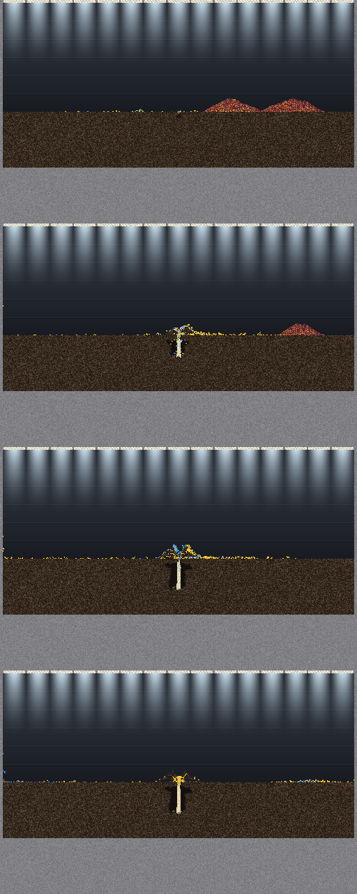

# Boom and bust: the colony breeds until the food is gone, then dies all at once (2026-10-08)

**The owner's playtests of 2026-10-07, reproduced headless and traced to the
bank of every ant.** Step 2 of the playtest plan (the plan file in the session
that wrote this; its standing summary is in `Reports/handoff/PLAN-2026-10-07.md`
once updated). Measured unless marked *inferred*.

## The answer, in one paragraph

A colony landed beside a large food store that never comes back grows to
400-500 ants, eats the whole store in about 40,000 frames, and then **every
adult dies within 3,000-20,000 frames of the last bite**: 460 of 472 ants on
seed 2 starved between frames 45,000 and 47,000. There is no reserve
anywhere. When the food runs out the median ant holds 107-169 J, about
1,000-1,500 frames of living, the whole colony 50-103 kJ against the 1.92 MJ
it ate, and the nest store holds 1-6 cells. Eggs keep coming almost to the
last bite (7-37 in the final 5,000 frames), and 174-201 brood are left to
starve. That is the owner's idea 1 ("our population grows quickly as we get
more food"), and his idea 2 restated: there *is* a surplus, but it goes into
new ants and is never banked. His idea 3 holds in code (no fullness gate, no
energy ceiling; the rich 10% hold 1,100-4,700 J), but those banks go into eggs
as food runs short, not into surviving the famine.

## How it was run

- **Scenario** `assets/lab_scenarios/boom_bust.ron`: the nest goal's box and
  colony (52 ants at column 256, frame 6,000, no plants, mister off), and
  2,000 cells of provisions (1.92 MJ) in two heaps at columns 330 and 420
  that nothing refills. `steady_income.ron` (10 cells every 1,000 frames) is
  its pair for the stable-population test and is not run yet.
- **Switches:** the owner's exact playtest line (`74a2f08a`'s:
  `NEEDS_FIRST=on,backfill CARRY_HOME=on DOOR_COLUMN=on LAY_BAR=body
  NEST_STORE=on,pick=20,jaws,sky,meal,smell=10 WAY_FOOT=on MUTATION=off`),
  arm `play`; the same plus `edible`, arm `edible`.
- **Binary:** `deeptrace` at `f55b33b8` (the stack as merged in PR 655;
  every switch off by default, these set by environment), `food=0` so the
  harness never tops a heap up, `hungry=1 dig=1 mapevery=10000`,
  `RAYON_NUM_THREADS=1`, seeds 1-4. Script: [`run.sh`](run.sh)
  (`run.sh play|edible SEED`). Run data is not in the repo; it regenerates
  deterministically.

## What happened

| arm | seed | peak ants (frame) | eating stops | all dead | median bank at food-out | colony bank | brood left | store cells |
|---|---|---|---|---|---|---|---|---|
| play | 1 | 407 (46k) | ~50k | 56k | 169 J | 71 kJ | 174 | 1 |
| play | 2 | 508 (39k) | ~43k | 47k | 121 J | 67 kJ | 174 | 3 |
| play | 3 | 457 (41k) | ~45k | 48k | 107 J | 50 kJ | 201 | 3 |
| play | 4 | 476 (39k) | ~42k | 66k | 168 J | 103 kJ | 181 | 6 |
| edible | 1 | 437 (42k) | ~45k | 51k | 212 J | 110 kJ | 180 | 5 |
| edible | 2 | 492 (39k) | ~44k | 49k | 76 J | 43 kJ | 192 | 7 |
| edible | 3 | 447 (41k) | ~44k | 56k | 169 J | 86 kJ | 195 | 0 |
| edible | 4 | 476 (39k) | ~46k | 66k | 27 J | 11 kJ | 177 | 3 |

"Eating stops" is the last frame `eats` rose; "all dead" the first frame after
it with no adult. Banks are `colony.csv`'s `energy_j` at the last census before
food-out.

- **The food really ran out.** The whole box at 6,500 / 30,000 / 43,000 /
  46,000 frames, ants coloured by job (the lab view from PR 659): both heaps
  whole, the near one gone, both gone, the colony dying. Nothing was left
  out of reach.

  

- **The fall, seed 2, per 1,000 frames:** ants 508 (39k), 495, 491, 483, 481,
  472 (44k), **312, 62, 0** (47k). Starved 21 → 481 in those last three
  thousand frames. Eggs 714 at 39k, 719 from 41k: laying stopped with the
  food and not before.
- **The banks drain together.** Seed 2, all ants: median bank 364 J at 33k,
  289 at 38k, 230 at 40k, 121 at 43k (food out), 22 at 45k. The number
  holding 1,100 J or more (enough to lay) falls 49 → 28 → 14 → 0 from 35k to
  43k while 83 more eggs are laid: the rich spend their surplus on eggs and
  larvae as the food runs short (*inferred* from the timing; the per-ant
  ledger of who laid is not joined yet).
- **Where the 1.92 MJ went** (*inferred*, seed 4): about 0.62 MJ into the
  525 ants raised (120 J an egg plus about 1,060 J of larval food each), about
  0.1 MJ left in banks at food-out, and about 1.2 MJ spent living over 10.9
  million ant-frames, about 0.11 J per ant per frame. At that rate the
  median food-out bank lasts 1,000-1,500 frames, which is the gap between
  the last bite and the mass death.
- **`edible` changes nothing here.** The store holds 0-7 cells at food-out
  in both arms; the colony never banks food in it during a boom.

## What this means for the fix (inferred, for the proposals)

- **A brake that only slows births is half of it.** Even a colony that stopped
  laying at the right moment would die within about 1,500 frames of the last
  bite, because nobody holds more than that. Real colonies ride out a famine
  on stored food: repletes, crops, a larder (sources to check before citing).
- **The two brakes Scott chose** each touch one side:
  - `SATED` (a full ant stops eating) leaves food in the world longer and
    makes fewer rich layers. It slows births and lengthens the food, but it
    does not bank anything.
  - `FEED_FIRST` (feed hungry larvae before laying) ties eggs to larval
    hunger. It slows births when food is short, and the 174-201 brood left
    starving say that is when it matters.
- **A third candidate the trace raises:** the nest store is built, and is
  empty in a boom. A store that banked surplus when food was plentiful
  would be the colony's reserve. Why it stays empty is untraced: the
  `pick=20` fetch takes door food, and in a boom the food is eaten at the
  heap, not dropped at the door.
- Test of any fix here: not survival (finite food ends every colony), but
  **the shape of the end**: births slowing as the store shrinks, a colony
  that falls gradually, the brood not left behind; and under
  `steady_income`, a colony that settles instead of swinging.

## Not done yet

- The layers traced individually: who lays in the last 10,000 frames, their
  bank, their distance from the larvae (the egg-cap census patch,
  `Reports/handoff/2026-10-07/egg-cap/tools/census.patch`).
- `steady_income` runs, and setting its rate from a first run.
- The playtests' own bed (the hand-built `herb_ant` box at 1024x512) is not
  reproducible headless; `boom_bust` stands in for it. The owner's playtest
  1 showed the same cliff (food gone near 400k, every adult dead by 410k).
