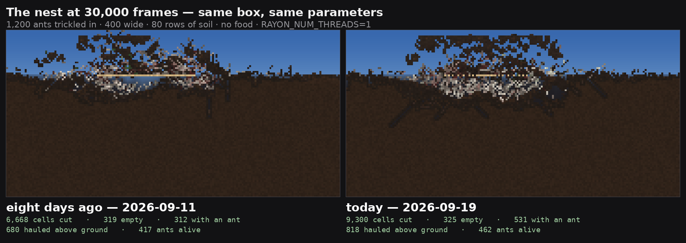
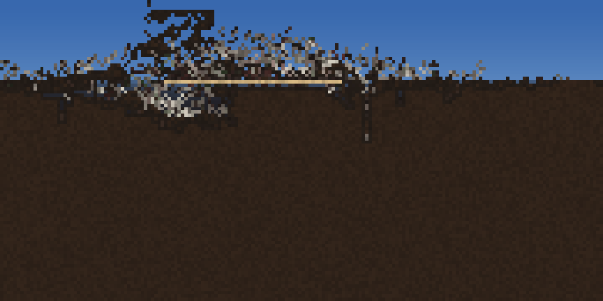
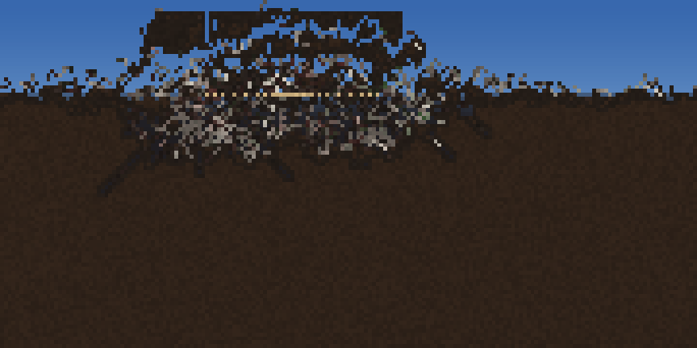
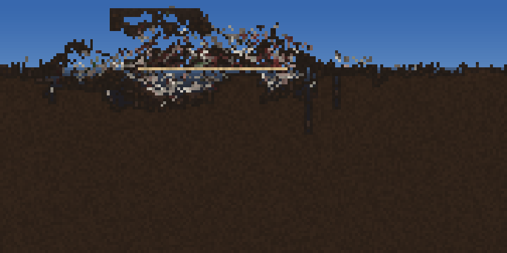
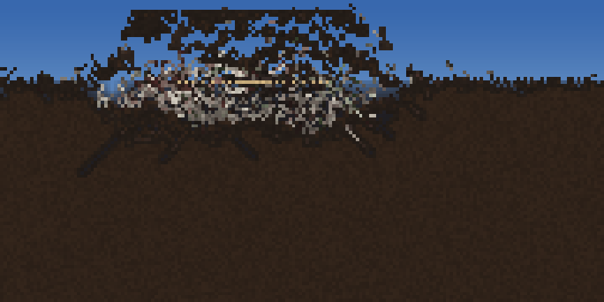
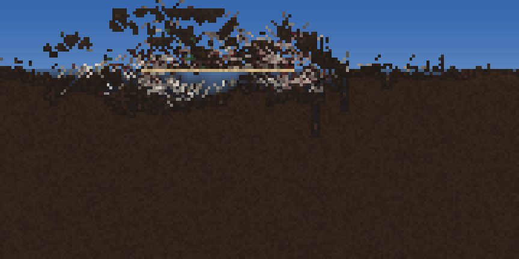
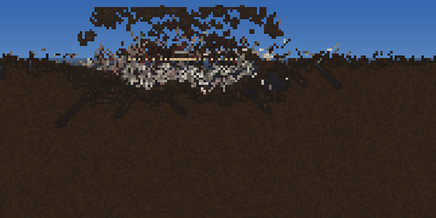

# Did the colony's digging change in the last eight days?

**2026-09-19. Status: measured, and the answer is yes — more digging, reaching
the same amount of standing room sooner.**

The question had been asked twice on the lab bed and could not be answered
there: measured 2026-09-19 over a four-way sweep at three seeds, roofed void
came back 226/116/381/293/262 on one seed and 97/86/77/58/108 on another. The
bed's seed-to-seed spread is 2–5x, larger than any effect being looked for.
`examples/digbox` is a bare isolated box — stone shell, soil fill, air, no
food, no plants, no weather — built to take that variance out. It exists on
`claude/sweet-tesla-ommknn` and did not exist eight days ago, so it was
carried back.

**Both arms are the same harness at the same parameters.** The census, the
builder, the trickle and the run loop are byte-identical between the two
copies (diffed, not assumed); the port is 235 removed lines and 4 reworded
ones, all of them instrumentation. `Reports/data/digbox-port-to-ccaef282.diff`
is the whole of it.

```
digbox ants=1200 rate=8 w=400 soil=80 frames=30000 stops=10000,20000,30000 scale=2
RAYON_NUM_THREADS=1
```

| | |
|---|---|
| **then** | `ccaef282` — 2026-09-11, "Merge pull request #341 … lab-fission-design-r29" |
| **now** | `50bacc64` — 2026-09-19, head of `claude/sweet-tesla-ommknn` |

`sweet-tesla` is 8 commits behind `main` and every one of the 8 is under
`Reports/`, so "now" is `main`'s behaviour. Its two `src/` additions
(`nest_site_rows`, `crowding_local`) are env-gated and both switches were
unset, so both arms ran the shipped `AtNest` material test.

---

## 1. The two tables

**Then — `ccaef282`, 2026-09-11**

```
   frame   ants     digs   roofed    open  ants in it  room total  hauled up    charge
   10000    484     2841      106      38         247         391        372    1953.5
   20000    385     4908      214      76         242         532        574    2132.0
   30000    417     6668      226      93         312         631        680    2169.5

SUMMARY digs=6668 roofed=226 open=93 ants_in_it=312 room_total=631 hauled_up=680 spoil_dumped=6633
```

**Now — `50bacc64`, 2026-09-19**

```
   frame   ants     digs   roofed    open  ants in it  room total  hauled up    charge
   10000    681     5026      167     130         765        1062        865    1922.2
   20000    526     7455      157     165         692        1014        941    2075.2
   30000    462     9300      190     135         531         856        818    2125.6

SUMMARY digs=9300 rolls=224904 per_roll=0.041 roofed=190 open=135 ants_in_it=531 room_total=856 hauled_up=818 spoil_dumped=9172
```

The 10,000 and 20,000 rows of the "now" arm reproduce the coordinator's
reference figures digit for digit on a different machine, which is the
positive control that this binary is the tree it claims to be.

**`room total` is `roofed + open + bodies`.** `roofed` and `open` count cells
that are materially empty, and a gallery with an ant standing in it is not
empty; at 500+ animals of a two-cell body that is most of the nest. Every
earlier figure in this line was quoted on `roofed` alone.

## 2. Now against then, as ratios

| at frame | ants | digs | standing void (`roofed+open`) | ants in it | room total | hauled up |
|---|---|---|---|---|---|---|
| 10,000 | 1.41x | **1.77x** | 144 → 297, **2.06x** | 3.10x | 2.72x | 2.33x |
| 20,000 | 1.37x | **1.52x** | 290 → 322, **1.11x** | 2.86x | 1.91x | 1.64x |
| 30,000 | 1.11x | **1.39x** | 319 → 325, **1.02x** | 1.70x | 1.36x | 1.20x |

**Colony size is not matched, so `digs` is not per-capita.** Both arms
trickled 1,200 ants in at 8 a frame and the survivor counts still differ at
every stop. Per surviving ant the gap is smaller and does not close: 5.87 →
7.38 at 10,000, 15.99 → 20.13 at 30,000, about **1.26x** at both ends. The
ant-count difference is itself part of what changed, not only a confound.

**A matched-colony control exists and agrees.** The harness's own selftest
sensitivity arm founds exactly 30 ants with `found_colony_of` and runs 4,000
frames on the same scene — colony size fixed by construction:

```
then:   30 ants, 4,000 frames -> 166 digs, roofed 9
now:    30 ants, 4,000 frames -> 351 digs, roofed 9
```

**2.11x the digging, and identical standing void.** That is the whole result
in miniature.

**Conservation holds on both trees**, so neither number is an artifact of
material going missing: `spoil_dumped / digs` is 0.995 then and 0.986 now.

## 3. The shape, which the ratios hide

The two arms are not the same curve scaled.

- **Then**, every column climbs monotonically and is still climbing at 30,000:
  room total 391 → 532 → 631, `roofed` 106 → 214 → 226.
- **Now**, room total *peaks at 10,000* (1,062) and falls away to 856; `ants
  in it` peaks at 765 and falls to 531. The nest is finished early and then
  erodes back.

And the standing void converges: 144 against 297 at 10,000 is a 2x gap, and
319 against 325 at 30,000 is a 2% one. **The two trees end at the same amount
of empty room. Today's colony gets there by frame 10,000 and the older one
needs the full 30,000.** What the extra 2,632 digs bought was speed, plus the
`ants in it` and `hauled up` columns, which are still 1.70x and 1.20x apart at
the end.

## 4. The images

**The result in one picture — 30,000 frames, both arms side by side:**



Cropped to the nest (world x 125..305 of 400, centre x = 200), same crop and
same scale on both arms. Top to bottom: 10,000 / 20,000 / 30,000 frames.

| then — `ccaef282` | now — `50bacc64` |
|---|---|
|  |  |
|  |  |
|  |  |

By eye, and consistent with the columns: the newer nest carries **long
diagonal galleries running down and out from the core**, which the older one
does not have — the older one's only downward marks are two or three short
vertical shafts. The newer mound above the surface is larger and reads as one
body; the older one is scattered clumps. **Neither gets deep**: both stay
inside the top ~25 rows of an 80-row soil bed, and the floor is untouched in
both. Whatever changed, it did not change that.

## 5. What had to be stripped, and whether any of it is itself the answer

**No `src/` change was needed on either tree.** The port compiled unmodified
against `ccaef282` once the items below were removed, so the engine's public
surface did not *move* under the harness in these eight days — it only gained.

Missing at `ccaef282`, and stripped:

| gone | what it is | cost to the measurement |
|---|---|---|
| `creature::probe_full` | reads a live ant's true input/hidden/output vectors | `trace()` and `local_senses()` deleted outright. Diagnostic; touches neither census nor run loop |
| `creature::nest_site_rows` + `PIXEL_PHYSICS_NEST_SITE_ROWS` | this week's site-based `AtNest` branch | one `println!`. The switch is off on the "now" arm, so **both arms ran the same `AtNest` rule** |
| `CreatureStats::dig_rolls` | `+= 1` at `src/sim/creature.rs:8573` today | no `rolls`/`per_roll` column for the older tree, and the selftest's "not one dig was even *attempted*" arm collapses into "not one dig *landed*" |
| `CreatureStats::at_nest_crowding` | `+= 1` at `src/sim/creature.rs:4143` today | no crowding-band histogram for the older tree |
| the `gate=` block | re-centres the chamber gate via `ih_slot` | stripped for tidiness, not necessity — `ih_slot` and `BrainInput` both exist at `ccaef282`. Not exercised by these parameters |

Both counters are pure increments with no behavioural coupling — checked at
their write sites — so dropping them changes nothing that was measured.

Checked and **present** at `ccaef282`: `SpeciesStore::get_mut`,
`plant_creature_seed_in`, `colony_of_site`, `moisture_gradient`,
`paint_nest_patch`, `found_colony_of`, `schedule_active_site`,
`step_active_sites`, `step_fields`, `step_pheromones`, `set_weather_pin`,
`set_sky_hold`, `take_touched_chunks`, `live_organism_ids`, `ih_slot`,
`with_aux`, `with_attached`, and `CreatureStats::{digs, spoil_dumped}`.

`World::room_surface_at` is **absent** at `ccaef282` — a genuine addition in
the window — but `digbox` never calls it, so nothing was stripped for it. The
`spoil` material and `PIXEL_PHYSICS_SPOIL_FOOTING` likewise never appear in
the harness; its three `spoil` hits are all `spoil_dumped`, which does exist
at `ccaef282`.

**One strip is not a strip, and it is a real difference between the two
engines.** `BrainInput` gained a variant in the window:

```
ccaef282 :  ... Stillness absent, enum ends at 28
main     :  ... Stillness = 29
```

`BrainOutput` is byte-identical. **A new input widens the ant's input vector
and therefore its genome**, and there is a commit in the window that reads
straight onto it. This was not removed from the port — it is a property of the
older engine — and it is a live candidate for §2.

## 6. Candidates, not attribution

Attribution is a separate job and this report does not do it. The window is
`git log ccaef282..origin/main --oneline -- src/sim/creature.rs
src/sim/update.rs assets/materials/`, which is 70-odd commits. The ones whose
subjects touch what §2 and §3 measure:

- `ec1dffdd` **Rest with an end: an animal that stands still gets restless** —
  pairs with the new `BrainInput::Stillness`. Most direct candidate for a
  higher dig rate at matched colony size.
- The stacking series — `26839803`, `aa133a06`, `355cb80f`, `0bcc87f6`,
  `03680ad2`, `28417171` — **"a body may stand in a cell another body owns"**,
  plus riders feeding each other and a rider's body reaching the ground. These
  reach `ants in it` and the survivor counts directly.
- `cd43538c` Lift the organism ceiling off 4,095 (`organism_id` u16 → u32).
- `9899a2d2` The scent planes widen to u16 — trail resolution.
- `813fb890` rivalry ships ON: `ant.ron scent_spread 2.0` — an authored asset
  change to the ant.
- `5a180d99` ants may trade places with a nestmate; `5824fd1d` the kin swap
  orphaned the displaced ant's scheduler site.
- `8b0078e6` Creature pass: an exact parallel read phase.
- `45642414` `SPOIL_IS_CARGO`; `c384cdc5` Bound the spoil lift — both reach
  `hauled up`.

## 7. The answer, in a paragraph

**Digging changed, and it got faster rather than bigger.** Today's colony cuts
1.4–1.8x the cells the 2026-09-11 colony cuts over the same 30,000 frames, and
2.1x at matched colony size in the selftest's own control — but it ends with
the same standing void, 325 cells against 319, a 2% difference. The whole of
the extra digging buys *arrival*: today's nest is at its full 300-odd cells of
empty room by frame 10,000 and then plateaus and erodes, where the older one
climbs steadily and only reaches the same place at 30,000. The columns that do
stay apart at the end are the ones about bodies rather than void — 531 against
312 cells holding an animal, 818 against 680 hauled clear of the surface — and
the colony that produced them is 462 ants against 417. **The week-old
suspicion is not retired: this is not a null.** But it is also not "the nest
got bigger", which is the reading the `roofed`-only figures in this line would
have given, and the direction to look is at rate and at occupancy, not at how
much room the mechanism is ultimately willing to open.
