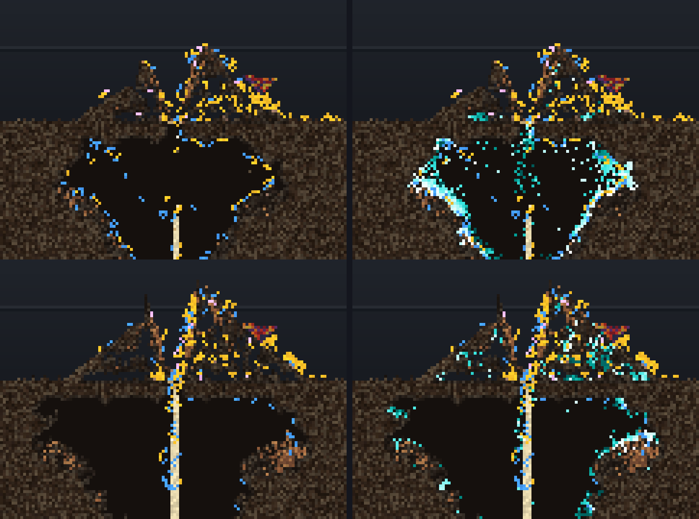

# Who digs the holes in the mound: idle foragers in its hollows (2026-10-08)

**Step C of the playtest plan**, the owner's request after the 2026-10-07
playtests: *"Digging in the mound is obviously a problem to solve. Trace the
ants that dig those holes."* Every ant that cut a mound cell, traced
individually, on two seeds. Measured unless marked *inferred*. No fix yet:
the levers are at the end, for the owner to pick from.

**Runs:** `deeptrace dig=1 hungry=1` on `steady_income` (40 cells of food
per 1,000 frames, a colony of 220-350), the owner's playtest switches plus
`NEST_STORE` `edible`, mutation off, 200k frames, seeds 1 and 4. These are
the FEED_FIRST off-arm reruns (`Reports/feed-first-2026-10-08/`, branch
`claude/eloquent-johnson-axjvu1-feed-first` until it lands), identical row
for row to the runs without `dig=1`. Geometry: door column 256, old ground
line 160, food heap at 286. **A mound cut** is a cut at or above row 160
within 40 columns of the door, not of food; a **nest cut** (below 160) is the
control throughout. Reader: [`moundtrace.py`](moundtrace.py) (`python3
moundtrace.py RUNDIR OUTPREFIX`, about a minute a seed); its full output, with
every mound cut of the top three diggers, is [`raw-output.md`](raw-output.md).
Numbers are seed 1 / seed 4.

*The mound over the door, seed 1, the same switches in the lab: 100k frames
on top, 180k below; the right column adds the dig heat map (teal and white:
cells cut recently). Ants by job: amber forager, blue nest worker, pink
layer. The mound has become a lattice of holes, crowded with foragers, and by
180k the fresh cuts sit inside it. Lab run (`labshot`, 248-261 ants, 864-1,096
cuts in the map's window), not the traced run, so the holes are not the same
holes.*

## The answer in plain words

The holes are not dug by a few rogue ants, and the ants do not think the mound is home. They are dug by **idle, well-fed foragers who loaf about on the mound** — around 1,100 different ants per seed, each cutting a cell or a few. The top ten account for only 4–5% of the cuts. An ant on the mound's rough, porous surface often ends up with its head in a hollow. The brain's one dig wire that is not limited to the nest, "dig more where the ground curves round you" (`SurfaceCurvature -> Dig, -1.0`), then gives it a small dig chance, 0.2 on average. The dig-down turn also fires, because a hollow reads as "enclosed", so the ant cuts the cell under itself. Neither gate stops it on the mound. The roof never refuses ground above the old ground line. The heap cue steps aside for an enclosed digger cutting a cell that still has ground over it, and 94% of mound cuts have ground overhead. The ant then carries the pellet ~11 cells up and puts it on top of the mound. The cut cell is filled again within a few hundred frames, almost always by the soil above sliding in. That moves the void upward instead of closing it, so the holes pile up. Covered open cells in the mound go from about 0 to 220–300 by the end, and most of them are cells that were once cut. Mound cutting also grows late in the run, from about 5% of all cuts to 14–19%.

## How it happens, with numbers (s1 / s4)

| | mound cuts | nest cuts (control) | |
|---|---|---|---|
| cuts | 4,022 / 4,333 | 44,177 / 35,939 | measured |
| distinct ants | 1,105 / 1,099 | 1,187 / 1,080 | measured |
| top-10 ants' share | 5.3% / 3.8% | | measured |
| ants needed for half the cuts | 227 / 246 | | measured |
| ants with exactly 1 mound cut | 346 / 278 | | measured |
| nest-bound worker | 8.9% / 7.3% | 90.9% / 92.5% | measured |
| `at_nest` = 1 | 1.9% / 1.4% | 98.6% / 96.9% | measured |
| `home` (cut cell touches dug home) | 0.9% / 0.8% | 94.1% / 91.3% | measured |
| walking back to a face (`ret` set) | 1.1% / 0.8% | 73.3% / 78.2% | measured |
| mean `dig_p` at the cut | 0.196 / 0.170 | 0.780 / 0.779 | measured |
| head curvature <= -0.3 ("enclosed") | 94.3% / 95.5% | 39.3% / 44.8% | measured |
| DOWN flag (dig-down turn aimed it) | 73.4% / 78.1% | 27.4% / 31.2% | measured |
| target below head | 77.0% / 77.4% | 91.0% / 91.4% | measured |
| `roofed` (ground above cut cell) | 94.2% / 94.6% | 83.9% / 83.6% | measured |
| `food_adj` | 5.6% / 5.2% | 58.5% / 66.6% | measured |
| open8 / ground24 | 2.95, 15.6 / 3.02, 15.2 | 4.95, 9.5 / 5.13, 9.0 | measured |
| nestmates within 3 | 3.71 / 4.34 | 3.37 / 2.83 | measured |
| holding at the cut | nothing 100% | nothing 100% | measured |
| energy_j at cut (colony.csv), median | 242 / 259 J | 205 / 207 J | measured |
| energy_j >= 1100 J (about the body laying bar) | 2.0% / 2.0% | 0.5% / 0.8% | measured |
| continues own previous cut (<=600 f, <=2 cells) | 10.9% / 5.7% | 59.8% / 62.9% | measured |
| 5th+ cut of such a run | 0.7% / 0.4% | 24.8% / 28.3% | measured |
| cell refilled later | 95.2% / 94.5% | 96.2% / 91.2% | measured |
| median frames to refill | 397 / 461 | 199 / 300 | measured |
| refilled by falling/sliding soil | 93.8% / 97.5% | 81.2% / 78.8% | measured |
| next pellet drop on the mound | 80.4% / 78.9% | 7.3% / 8.5% | measured |
| median drop distance | 11 / 12 cells | 4 / 4 cells | measured |

**1. Who.** These are foragers with nothing to do: 91–93% of mound cuts are by ants without the nest-bound flag. Their median energy is about 250 J, at or above start energy, and only 2% are over the ~1,100 J body laying bar (`LAY_BAR=body`: `reproduce_threshold` scaled by each ant's heritable `reproduce_at`; 1,034 J in the 2026-10-07 laying census), so they are not layers. They hold nothing. At 83–87% of cuts the home pull is `not scored`. Their job is Forager, inferred from the worker flag plus energy. Nurse was not ruled out from the code, but the crop was empty at 100% of cuts. The mound zone holds a lot of ant time: 4.1M / 3.9M decisions, against 2.2M / 2.1M in the nest. Of those mound decisions, 73% are by foragers, 91–94% are at or above start energy, and 53% / 51% have the pull `not scored` (18–19% `none`) (measured). The top diggers' ledgers show the same thing: most of their lives are spent on the mound. For example, s1 ant 81 made 10,842 mound decisions against 477 in the nest. The per-ant tables are below.

Deaths: 453 / 411 of the diggers died within 5,000 frames of their last mound cut. Most deaths were old age (548 / 666), then starvation (233 / 106). There is no matched control for this, so **no link between mound digging and dying is found** (not established).

**The top-digger ranking is partly an artifact.** The #1 digger in each seed is a "put-back loop" ant: it cuts a cell and drops the pellet straight back into it 5 frames later with `spoil_why = need`. s1 ant 6291659 did 14 of its 30 mound cuts this way and 1048708 did 11 of 39. s4 ant 1048666 did 19 of 24. Across all mound cuts the loop is only 2.1% / 1.0%, against 2.7% / 2.8% of nest cuts, so it is not specific to the mound (measured). Leaving it out, top-10 share is 4.5% / 3.6%.

**2. Why the dig fires there.** The dig urge does *not* think the mound is home: `at_nest` is set at 1.9% / 1.4% of mound cuts and `home` at 0.9% / 0.8% (measured). The nest gate (`AtNest x Crowding`, worth +5.4 at nest cuts) is about +0.1 at mound cuts. What does decide it is the curvature at the head (measured: cuts per 1,000 decisions with the head in the mound zone):

| head curvature | mound s1 | mound s4 | nest s1 (control) | nest s4 |
|---|---|---|---|---|
| +0.2 | 0.05 | 0.04 | 30.2 | 20.1 |
| 0.0 | 0.12 | 0.07 | 44.2 | 33.0 |
| -0.2 | 0.28 | 0.26 | 77.2 | 72.5 |
| -0.4 | 19.4 | 23.1 | 239.9 | 247.5 |
| -0.6 | 41.6 | 61.2 | 313.6 | 326.6 |
| -0.8 | 93.8 | 118.5 | 326.5 | 321.5 |

On the mound, the cut rate rises about 2,000x from flat ground to a deep hollow. In the nest, `dig_p` is about 0.7–0.77 whatever the curvature, because the at-nest gate saturates it, so curvature matters only through which cut is available. Rebuilding the urge from `ant.ron`'s Dig wires gives mean terms at mound cuts of: curvature +0.495 / +0.466, bias -0.300, gate +0.117 / +0.091, food +0.045 / +0.042 (inferred). The rebuild matches the logged `dig_p` within 0.02 at only 42% / 49% of mound cuts; most of the rest are off by up to -0.1, and the founder genome carries weights not decoded here. So the term split is approximate, but the curvature table is direct.

**The dig-down turn aims it.** 73% / 78% of mound cuts carry `DIG_FLAG_DOWN`, against 27% / 31% in the nest. The turn is `enclosed_only` and fires when curvature <= `SPOIL_CUE_ENCLOSED` (-0.3); 94–95% of mound cuts meet that (measured). So an ant standing in a hollow turns its jaw down and cuts the mound cell under itself.

**Neither gate stops it.** For mound targets where the roll won, the verdicts are: cut 3.3% / 3.6%, heap cue 14.3% / 12.3%, roof 10.8% / 8.9%, face 2.3% / 1.5%, nothing to cut 69% / 74% (measured).
- The roof refused only at row 160, the founding row itself: 13,096 / 10,544 refusals, none above it (measured). That matches the code: "Ground above the founding surface (a heap) is never refused".
- The heap cue refused mostly in rows 158–160: 16.6k of 17.3k refusals in s1. Inside the mound (rows <= 157) it refused 718 times against 2,453 cuts there (s1, measured). The reason is in `spoil_cue_factor`: it returns `None` (no veto) for an enclosed digger whose target is not open to the sky (inferred from code, consistent with 94% roofed).
- Near the food heap (within 12 columns of x=286), mound targets are refused by the roof much more often (36% / 41%) and cut far more often (21% / 20%). There the ants are on the heap (head zone `food`), not idling on the mound.

**3. What the hole is.** It is scraping into hollows inside the mound, not a tunnel driven forward. Only 10.9% / 5.7% of mound cuts continue the same ant's previous cut, and 0.7% / 0.4% are the 5th or later cut of a run. In the nest those figures are 59.8% / 62.9% and 24.8% / 28.3%, so the metric does tell tunnelling apart (measured). The cut cells are surrounded by ground (open8 about 3, ground24 about 15) and covered (94% roofed).

95% of mound cut cells are refilled later, with a median of 397 / 461 frames, and 94–98% of those refills are soil falling or sliding in rather than a dropped pellet (measured). That does not close the hole: it moves it up. Of the once-cut open cells in the mound at frame 200,000, 149 / 139 were last opened by ground falling away and 59 / 81 by a cut (measured).

The standing state, as covered open cells in the mound box (an open cell with ground above it in its column):

| frame | s1 covered open | s1 of which once cut | s4 covered open | s4 of which once cut |
|---|---|---|---|---|
| 15k | 1 | 0 | 2 | 1 |
| 55k | 91 | 31 | 141 | 71 |
| 95k | 158 | 103 | 220 | 161 |
| 135k | 246 | 185 | 209 | 144 |
| 175k | 287 | 193 | 285 | 178 |
| 195k | 302 | 215 | 221 | 172 |

The rest of the covered open cells are mostly ants standing in holes. Never-cut voids are only 9–21 cells (measured). So **the holes on screen are dug holes plus the voids they push upward**. They do not come from the way spoil is dumped.

**4. Where the pellets go.** 80% / 79% of mound-cut pellets are next put down on the mound itself, a median 11 / 12 cells away and higher up. The drop rows peak at 140–146, against cut rows 149–159. `spoil_why` at the drop is `placed` 70% / 72% or `lifted` 21% / 25%, and the head is on `mound_top` for 73% / 59% of drops. While carrying, the pull is `spoil haul` 66% / 69% (measured). The mound is being turned over: soil is cut from its lower inside and piled on its top.

**5. Over time.** Mound cuts per 20k frames, with mound share of all cuts in brackets:

| frames | s1 | s4 |
|---|---|---|
| 0–20k | 14 (1.6%) | 15 (2.9%) |
| 20–40k | 218 (10.8%) | 260 (11.5%) |
| 40–60k | 374 (10.3%) | 681 (12.5%) |
| 60–80k | 600 (11.5%) | 188 (4.4%) |
| 80–100k | 282 (5.4%) | 313 (6.4%) |
| 100–120k | 530 (7.1%) | 213 (4.7%) |
| 120–140k | 350 (4.0%) | 524 (10.3%) |
| 140–160k | 442 (6.0%) | 707 (14.1%) |
| 160–180k | 679 (18.0%) | 539 (14.5%) |
| 180–200k | 533 (14.2%) | 893 (19.4%) |

Late in the run, mound digging rises while nest digging falls. About 140–260 distinct ants per window cut the mound (measured).

## Not established
- The exact Dig weights the founder carries: the rebuild from `ant.ron` matches only 42–49% of mound cuts within 0.02.
- Whether the ants are `Nurse` rather than `Forager` (`is_crop_nurse` not read).
- Any causal link between digging and dying.
- Why so many full foragers idle on the mound in the first place. Pull `not scored` / `none` is what the rows show, and the foraging side is out of this trace's scope.
- Curvature here is the logged brain input, not the dig-down turn's own trait-radius curvature (inferred to be the same quantity).

## Mechanism, in one chain
Idle, full foragers mill on the mound, with more ant-decisions there than in the nest. The porous mound puts heads in hollows (curvature <= -0.3). The `SurfaceCurvature -> Dig` wire gives `dig_p` of about 0.1–0.4 there with no nest gate. The enclosed-only dig-down turn aims at the cell below. The heap cue stands aside because the digger is enclosed and the cell is covered, and the roof never applies above row 160. The cell is cut, and the pellet is carried up and placed on top. The soil above slides into the cut, which moves the void up. Covered holes accumulate to 220–300 cells.

## The levers (inferred, untested; for the owner to choose)

1. **Gate the curvature term on being at the nest**, as the crowding term
   already is (hidden units 5/6 carry `AtNest x Crowding`): a genome change
   in `ant.ron`, so it needs the evolved founder re-checked too (the founder
   carries its own Dig weights; the rebuild above matched only 42-49%).
2. **Make the dig-down turn and the heap cue's exemption for enclosed
   diggers apply only below the founding surface**: a cut is still possible
   on the mound, but not aimed into it by every hollow.
3. **Extend the roof rule above the ground line**: refuse a cut in the mound
   (above the founding row, within the mound's reach) unless it is at the
   door's columns. The bluntest, and one predicate on the cut cell like the
   roof itself.

Whatever is picked must keep **`MOUND_OUT`'s `dig` part** working (on since
2026-10-06): a lean ant shut in the mound keeps its dig roll so it can cut its
way out, which saved shut-in ants when it was measured. Levers 1 and 2 leave
that roll alone; lever 3 needs an exemption for it. And the levers stop new
holes, not the ones already there: the voids are pushed upward by soil
sliding into each cut, so a mound that stops being cut should settle (to
check by eye in the lab, not assume).

## The same thing on main, and on the endless heap

Mound cuts as a share of all cuts in the default-flip comparison runs
(`nest_goal`, heap 90 columns from the door, 300k, seeds 1-8, `f55b33b8`,
`Reports/handoff/nest-race/tools/pair12.sh`; same definition of a mound cut):

| arm | all cuts | mound cuts | mound share |
|---|---|---|---|
| main (every switch off) | 8,605-11,548 | 7,367-9,990 | **84.6-86.5%** |
| the stack (the playtest line plus `edible`) | 49,573-90,621 | 12,078-14,518 | 15.1-29.3% |

So **mound digging is not something the stack introduced**: on main it is
most of the digging the colony does, because on main most of the colony
lives on the mound (handoff plan §6 step 3). The stack digs five to eight
times more in total, most of it in the nest, and still cuts the mound more
in absolute terms. The curvature wire is on main (`ant.ron`, since
2026-09-28), so the chain below applies to both; *inferred*, since the main
arm was not traced per ant.

## What the curvature wire was for

`(SurfaceCurvature, Dig, -1.0)` with the bias at -0.3 (`assets/species/ant.ron`,
2026-09-28, `Reports/nest-dig-wiring-2026-09-28.md`) replaced a residual dig
urge that scraped a crust across the whole box: openings to the surface 27.5
-> 10 on 12 of 12 seeds in `digbox` (40 ants, frame 12,000). That bed has no
spoil mound worth the name at 12k frames. On a mound grown for 100k+ frames,
a porous heap of loose soil puts heads in hollows everywhere, and the wire
reads every hollow as a face.

## Tested: all three levers at once (`PIXEL_PHYSICS_MOUND_DIG=on`) -- the holes are the way through

Built off on branch `claude/eloquent-johnson-axjvu1-mound-dig` (`MoundDig`,
`creature.rs`: `down`, `cue`, `roof`, each one predicate about the digger's
head or the cut cell; "in the mound" is above the nearest site's founding
surface and within 40 columns of it). Same box, switches and seeds as the
trace, `dig=1`, 200k. **Identity:** the off arm's `stats.csv` matches the
traced runs on every shared column, row for row.

| seed | arm | colony min / mean after 100k | mound cuts | adults starved (surface / in the mound / nest) | larvae starved |
|---|---|---|---|---|---|
| 1 | off | 221 / 269 | 4,022 | 424 (380 / 43 / 1) | 142 |
| 1 | on | **136 / 185** | 246 | 493 (298 / **178** / 17) | 190 |
| 2 | off | 225 / 268 | 4,349 | 387 (341 / 36 / 9) | 121 |
| 2 | on | **132 / 198** | 386 | 522 (416 / **101** / 1) | 213 |
| 3 | off | 244 / 272 | 3,938 | 191 (171 / 16 / 3) | 6 |
| 3 | on | **86 / 134** | 93 | 412 (296 / **116** / 0) | 283 |
| 4 | off | 243 / 275 | 4,333 | 198 (195 / 2 / 1) | 131 |
| 4 | on | **125 / 175** | 425 | 383 (268 / **107** / 1) | 213 |

**It stops the mound digging (cuts down 90-98%) and costs a third to a half
of the colony on every seed**, with 101-178 adults a run starving inside the
mound against 2-43. The ground maps say why (seed 1, 100k, rows 140-160 over
the door): off, the mound east of the door is hollow and full of ants all the
way to the food heap; on, it is solid soil to the heap, and the only way is
the door column and over a taller crest. **The holes are, in part, the
colony's own way through its mound to the food**, and the ants shut in it
when it cannot be cut starve there. So the mound's porosity is not only
waste; the levers have to leave a way through.

**Each part alone** (seeds 1 and 2; colony min / mean after 100k, mound
cuts, adults starved with surface / in the mound / nest):

| part | seed 1 | seed 2 |
|---|---|---|
| off | 221 / 269, 4,022, 424 (380 / 43 / 1) | 225 / 268, 4,349, 387 (341 / 36 / 9) |
| `on` (all three) | 136 / 185, 246, 493 (298 / 178 / 17) | 132 / 198, 386, 522 (416 / 101 / 1) |
| `down` | 235 / 272, 5,010, 346 (280 / 7 / 53) | 231 / 263, 4,773, 216 (194 / 0 / 21) |
| `cue` | 147 / 240, 3,364, 379 (344 / 34 / 0) | 142 / 185, 1,969, 307 (246 / 56 / 2) |
| `roof` | 77 / 175, 365, 529 (412 / 110 / 5) | 101 / 146, 336, 411 (254 / 148 / 4) |

- **`roof` is the part that stops the digging, and it carries all of `on`'s
  cost** and more (mean 146-175).
- **`cue` halves the cuts on one seed and costs the colony on both** (mean
  185-240).
- **`down` stops nothing**: with the turn gone, the roll cuts the cell ahead
  instead (mound cuts 4,773-5,010), and it harms nothing (starved lower on
  both seeds; not enough seeds to call it a gain).

**Verdict: `MOUND_DIG` ships off and is recorded as a dead end.** Every lever
that stops the mound digging takes away the colony's way through its mound.
A rule that could work has to tell a passage from a scrape -- for instance,
leave a cut alone when it joins open space toward the food or the door, and
refuse one into a dead-end hollow -- or give the colony another way to the
food (a trail over the mound, a door on the food's side). That is a design
question for the owner, not a retune.
