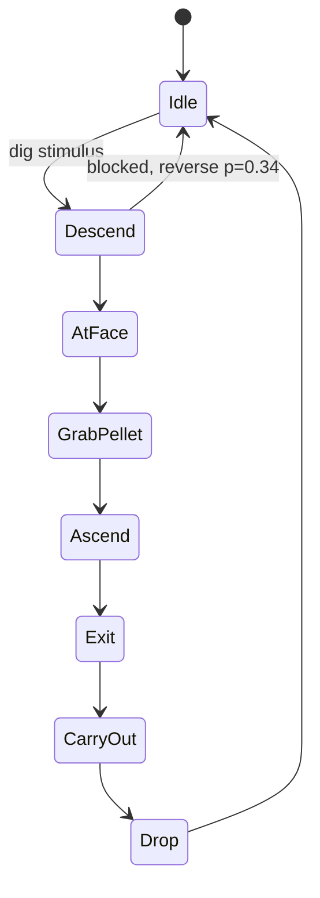
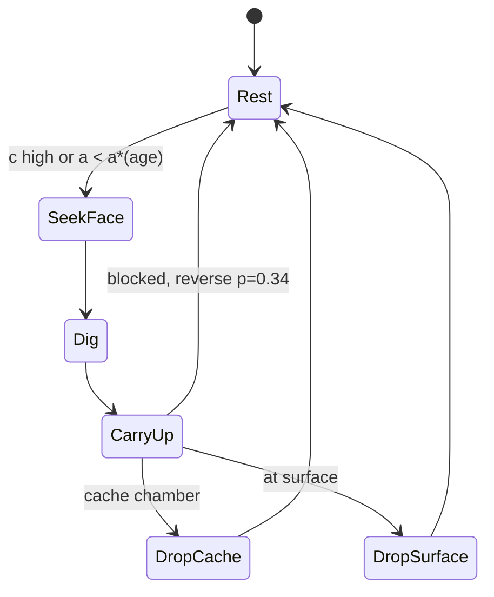

# Ant Nest Excavation: Mechanics & Simulation Reference

> **Provenance.** The owner's own document, handed to this session on
> 2026-09-20 and reproduced here **as received** — every number, citation,
> hedge and section unchanged, including the `mermaid` and `latex` fences,
> which nothing else in `Reports/` uses. The living version is at
> <https://claude.ai/code/artifact/e55ee49d-f67b-42d5-865d-cb0d7b4de62b>;
> **this file is the copy taken on 2026-09-20 and does not track edits made
> there afterwards.** Nothing in it has been checked against the engine.
> The document marks its own two kinds of statement — **measured**, against a
> cited study whose species and setup it names, and **modeling hypothesis**,
> where the literature is thin — and §14 lists the six pieces that rest on
> hypothesis. Those marks are the difference between a constant you can build
> on and one you are choosing, and they are the reason it was landed whole
> rather than summarised.

> **Where this lands in the nest program** — this session's routing note, not
> the document's. Three things in the live record bear on it directly.
>
> - **It repairs a hole the record states about itself.**
>   [`nest-biology-digging-signals-2026-09-19.md`](nest-biology-digging-signals-2026-09-19.md)
>   opens by saying every publisher and repository domain its lane tried was
>   blocked by the container's egress proxy, so *"every [search] claim below
>   rests on a search-result summary, not on the paper"*, and asks that a
>   number be read from the paper before it decides a build. This document
>   carries the URLs, and the per-study species and setup, that report could
>   not reach.
> - **§2 is the published form of the one lever still standing.**
>   [`nest-shape-three-negatives-2026-09-19.md`](nest-shape-three-negatives-2026-09-19.md)
>   §0 names the missing thing as *concentration* — *"nothing in the engine
>   makes a dug cell attract the next dig"* — and
>   [`nest-digging-plan-2026-09-19.md`](nest-digging-plan-2026-09-19.md) has
>   Stage 4, fresh spoil attracting digging, as the only candidate it has not
>   refuted. §2's dig-marker rule is that mechanism with a functional form and
>   published constants (K = 50, ν = 0.05, 100 units to a dug cell,
>   ξ = 0.001), and its note on why the x² term makes one shaft win over many
>   shallow pits is the behaviour both repo documents were reaching for.
> - **Its geometry is this engine's geometry.** §7 is written for a vertical
>   x–z cross-section and says which horizontal-arena results do not carry
>   over. Its *2D arching caution* — a slab cannot form the hoop of force
>   chains that stabilises a real 3D tunnel, so pure gravity sand collapses
>   far more than soil does — reaches the same wall `src/sim/load.rs`'s
>   `arch_span` doc records from the other side (`dead-ends.md`: *"in a 2D
>   side view a bore is a slot whose roof genuinely spans the whole
>   excavation"*).
>
> **Two collisions to know before building from it.** The §2 dig-marker is a
> decaying scalar on dug cells, **not a pheromone**, and that distinction is
> load-bearing here: a dig-face pheromone is *measured and negative* in this
> engine (`nest-digging-plan-2026-09-19.md`), while the physical form — spoil
> — is untested. And the pellet-placement rules in §3 and §12 (drop at a
> cache, ~2.5% embedded in walls en route, a crater walk out from the
> entrance) sit on a question this repo has already closed once: **both**
> hand-written placement rules for a dug pellet were built, measured and
> withdrawn, and the owner's ruling was that the drop belongs to the ant, on
> a roll against `drop_urge`, which is a brain output and therefore a gene
> (`dead-ends.md`, `src/sim/creature.rs` `act`). Neither is a reason not to
> read the document. Both are reasons not to lift a constant out of it into a
> rule this repo settled on other grounds.

2026-09-19 · Scott

Living version: https://claude.ai/code/artifact/e55ee49d-f67b-42d5-865d-cb0d7b4de62b

## Scope and conventions

This reference collects the measured mechanics, cues, and coordination rules ants use to excavate nests, from the entrance down to deep chambers, organized for building an agent-based simulation in a vertical (x–z) cross-section.

Two kinds of statements appear throughout:

- **Measured** — reported in a cited study, with its species and setup noted where it matters.
- **Modeling hypothesis** — a rule proposed here where the literature is thin. These are labeled explicitly and are the first things to tune or replace.

Most quantitative digging data come from quasi-2D lab arenas. Some are horizontal (no gravity, e.g. Toffin et al. 2009) and some are vertical frames (e.g. Rajendran et al. 2024, Avinery et al. 2023). Constants from different setups and species share the same functional forms but are not interchangeable. Fit per species.

## 1. Substrate mechanics

The transport unit is a roughly constant-size pellet, and a cell is diggable only above a moisture/cohesion threshold.

- **Moisture gates digging.** In fire ants, nest volume after 20 h barely changed across a ~50× range of grain size once water content reached about W ≥ 0.05; individual ants adjusted technique to make similar-size pellets in every material ([Monaenkova et al. 2015](https://journals.biologists.com/jeb/article/218/9/1295/14545/Behavioral-and-mechanical-determinants-of)).
- **Two pickup modes.** Some ants lift material directly; others loosen it and turn around to carry it, depending on grain size and moisture.
- **Arching stabilizes tunnels (3D).** X-ray CT of *Pogonomyrmex* tunneling showed force chains wrapping around the tunnel axis, lowering stress on surface grains, so almost any surface grain can be removed without collapse ([Buarque de Macedo et al. 2021](https://www.pnas.org/doi/10.1073/pnas.2102267118)).
- **Piecewise-linear descent.** The same study found ants dig in straight segments, each at a near-constant angle to the ground.
- **Shaft diameter ≈ body length.** Fire ant tunnels averaged D = 1.06 ± 0.23 L. Below Dₛ = 1.31 L, falls are always arrested by legs and antennae jamming against walls ([Gravish et al. 2013](https://arxiv.org/abs/1305.5860)).
- **Rate modifiers.** In *Formica pallidefulva*, soil excavated per unit time rose with soil temperature and moisture ([Mikheyev & Tschinkel 2004](https://link.springer.com/article/10.1007/s00040-003-0703-3)). Higher temperature speeds digging but produces the same nests ([Insectes Sociaux 2025](https://link.springer.com/article/10.1007/s00040-025-01049-7)).

## 2. Where digging starts

No single "dig here" signal exists; a founding shaft, environmental templates, and amplification of recent digging combine.

- **Founding shaft.** Often a lone queen digs the first entrance. *Atta vollenweideri* founding queens set nest depth by self-motion and time cues (Fröhle & Roces 2012, J Exp Biol 215:1642–50). In *Camponotus fellah*, the queen dug about 24 cm² before the first workers emerged ([Rajendran et al. 2024](https://elifesciences.org/reviewed-preprints/100706v1)).
- **Gravity.** Ants dig more often toward the bottom of a vertical setup (Sudd 1972, cited in [Toffin et al. 2009](https://www.pnas.org/doi/10.1073/pnas.0902685106)).
- **Thigmotaxis.** Ants strongly follow surfaces, so rock edges, cracks, and depressions are favored start sites.
- **Amplification.** In Toffin's model, earlier digging raises the probability of digging at the same place. Mechanistically this may be pheromone, disturbed soil, or aggregation; the model only needs a decaying scalar field on recently dug cells.

### Dig-marker rule (Toffin et al. 2009)

A cell is diggable if at least one of its 8 neighbors is open and an ant of head width can reach it. For each reachable cell i, with x = total marker in its 8 neighbors:

```latex
C_i = \frac{x^2}{x^2 + K^2} + \xi \qquad p_{\mathrm{dig}}(i) = \frac{C_i}{\sum_j C_j}
```

A dug cell receives 100 marker units; a fraction ν of all marker evaporates each step. Published values: 600×600 lattice, cell ≈ 0.07 mm², ant = 4 cells wide (*Lasius niger*, ~1 mm head), 1 min per step, K = 50, ξ = 0.1%, ν = 0.05.

The x² Hill term makes a slightly-dug site much more attractive than a fresh one, which is why one shaft wins over many shallow pits.

## 3. The individual digging cycle

Every study describes the same loop: remove grains or pellets at the face, carry, climb, exit, deposit ([Aguilar et al. 2018](https://crablab.gatech.edu/pages/publications/pdf/science-2018.pdf)).



Reversal on blocking is measured (section 5). Deep nests replace the single carry-out with a relay through cache chambers (section 11).

### Deposition and spoil heaps

- **Deposition is stigmergic.** *Lasius niger* workers prefer to deposit next to material other ants recently handled ([Khuong et al. 2016](https://www.pnas.org/doi/10.1073/pnas.1509829113)).
- **Marker lifetime sets pattern scale.** In Khuong's model, a deposition-marker lifetime above ~10 min produces structure; simulations used a 20 min mean lifetime and 500 ants ([PDF](https://crca.cbi-toulouse.fr/wp-content/uploads/2018/06/102.pdf)). Slow decay gives many regularly spaced pillars; fast decay gives few.
- **Crater (modeling hypothesis).** Each exiting ant walks a random distance r from the hole (e.g. r ~ Gamma, mean a few body lengths), biased toward fresh deposits, and drops its pellet. Angle of repose shapes the heap; wind or slope biases walk direction. No published entrance-crater equation was found.

## 4. Rate and stopping

Excavation self-limits: it accelerates, peaks, and stops as the nest reaches a size set by colony size, with no ant measuring volume.

### Observed curve (Toffin et al. 2009, horizontal arena, *L. niger*)

```latex
A(t) = A_M \frac{t^{\alpha}}{\beta^{\alpha} + t^{\alpha}}
```

Aₘ is final area, α the cooperation level (1.72 for 300 ants, 1.38 for 50), β the half-completion time (8.8 h for 300 ants, 12.2 h for 50) ([Toffin et al. 2009](https://www.pnas.org/doi/10.1073/pnas.0902685106)).

### Generative rule (drives the simulation)

```latex
\tau = \theta \, A^{0.5} \left(1 - \frac{A}{A_M}\right) \Delta t, \qquad N_{\mathrm{pel}} = \frac{\tau}{A_{\mathrm{cell}}}
```

A^0.5 approximates the crowded digging perimeter; (1 − A/Aₘ) shuts digging off. θ₅₀ = 0.38, θ₃₀₀ = 1.08. In 3D, use V^(2/3). Final area was about 20 cm² for 50 ants and 75 cm² for 300: area per ant falls as groups grow.

### Stopping without measuring (Deneubourg & Franks 1995)

Colony-size-to-volume matching emerges if ants dig when locally crowded. As the nest grows, density falls below threshold and digging stops. In a simulation, replace the explicit Aₘ with a per-ant density threshold.

### Shape transition

Round cavities sprout buds once area reaches about 60% of final, when activity density ρ = R/A falls to about 0.04 h⁻¹, independent of group size. With a linear digging rate, the model produced no transition; the nonlinear rate law is required for chambers that bud into tunnels.

## 5. Traffic and clog control in shafts

In single-lane shafts, idleness and retreat make digging faster, not slower.

- **Reversal.** In Aguilar et al.'s cellular automaton, an ant whose path to the face was blocked reversed toward the exit with probability R = 0.34, taken from observed fire ant reversals ([Science 2018](https://www.science.org/doi/10.1126/science.aan3891)).
- **Unequal workload helps.** The best excavation rate occurs when part of the group is inactive. In the robot tests, eager digging worked for three robots but collapsed at four; reversal gave steady jam-free digging; "lazy" was most energy-efficient ([EurekAlert summary](https://www.eurekalert.org/news-releases/507098)).
- **Active diggers ≈ √N.** Varying fire ant group size in a fixed arena, the number of active ants scaled as the square root of group size ([arXiv 2026](https://arxiv.org/html/2603.00281)).
- **Traffic-driven widening (provisional).** In unpublished Roces lab work, *Atta laevigata* workers widened a jammed tunnel section until traffic speed recovered, apparently responding to encounter rate ([Knowable 2026](https://www.knowablemagazine.org/content/article/living-world/2026/crazy-nests-leaf-cutter-ants-build)).

Simulation rule: give each agent a persistent dig propensity from a skewed distribution (or cap eligible diggers near √N), reverse with p = 0.34 when blocked, and widen wall cells where collision rate stays above threshold.

## 6. Number and placement of entrances

Entrance count grows with colony size and age, but no study identifies the rule that opens a new one.

### Measured

- **Count rises with colony size and age.** Larger, older red harvester ant (*Pogonomyrmex barbatus*) colonies have more entrances, all converging on one entrance chamber. The structure is a minimum spanning tree with the entrance chamber as hub, ringed by 1–6 unlinked chambers, with 2–3 tunnels descending 1–2 m ([Gordon, PMC12413562](https://www.ncbi.nlm.nih.gov/pmc/articles/PMC12413562/)).
- **Entrance chamber scale.** About 5 cm long and 2–3 cm below the surface, joined to the opening by a short tunnel ([arXiv 1709.08343](https://arxiv.org/pdf/1709.08343)).
- **Clustering.** *Myrmica rubra* entrances group into clusters at least 15 cm apart, with a bimodal spacing distribution ([Lehue et al. 2020](https://pubmed.ncbi.nlm.nih.gov/32455587/)).
- **Dynamic.** Entrance number and location track the underground distribution of workers and the location and quality of food ([PMC7290572](https://www.ncbi.nlm.nih.gov/pmc/articles/PMC7290572/)).
- **Costly.** Two-entrance *M. rubra* nests mobilized twice as many workers but reached food less often and chose the better source less reliably ([PLOS ONE 2020](https://pubmed.ncbi.nlm.nih.gov/32609769/)).

### Proposed breach rule (modeling hypothesis)

A new entrance is a tunnel that breaches the surface. Ants in a crowded entrance chamber dig upward or sideways with a probability given by the same Hill function of local density, biased toward outbound forager traffic:

```latex
p_{\mathrm{breach}} \propto \frac{\rho_c^2}{\rho_c^2 + K_c^2}
```

Each breach relieves chamber crowding, so count tracks colony size and traffic. Shared origin and bias should yield clustering. Low-traffic entrances can be plugged by deposition, so the count can fall as well as rise.

## 7. Vertical (x–z) cross-section

The rate law, crowding regulation, clog control, and dig-marker rule all carry over; gravity adds collapse, uphill transport, falls, and flat chambers.

**Well supported by data.** Vertical quasi-2D frames are a standard method: Rajendran et al. used frames 80 cm tall, 60 cm wide, 0.8 cm deep of moist fine sand ([eLife](https://elifesciences.org/reviewed-preprints/100706v1)); Avinery et al. used quasi-2D fire ant arenas ([J R Soc Interface 2023](https://pubmed.ncbi.nlm.nih.gov/37194494/)).

**Reinterpret horizontal results.** Toffin's circular first cavity came from a horizontal sand layer with no gravity. Toffin et al. noted gravity biases digging downward and may explain ellipsoidal chambers and vertical tunnels. Keep the marker rule; add a direction bias (section 10).

| New in x–z | Effect on the simulation |
| --- | --- |
| Collapse | Ceilings can fail; substrate model must decide what holds |
| Uphill transport | Every pellet climbs; trip length grows with depth |
| Falling ants | Vertical shafts wider than ~1.3 L let ants fall |
| Floors and ceilings | Chambers become flat-floored with near-constant height |
| Entrance geometry | Surface is a line; entrances are points; crater is a 2D heap |

**2D arching caution.** 3D tunnels are stabilized by force chains that hoop around the axis. A 2D slab cannot form that hoop, so pure gravity sand will collapse far more than real soil. Use a cohesive "moist" state that lets unsupported cells hang up to a maximum span, tuned against vertical-frame nests.

## 8. Whole-nest architecture targets

Ground-nesting ant nests are a roughly vertical shaft connecting roughly horizontal chambers, with chamber area concentrated near the top ([Tschinkel 2015](https://www.antwiki.org/w/images/8/83/Tschinkel,_W.R._2015._The_architecture_of_suberranean_ant_nests_-_buauty_and_mystery_underfoot.pdf)).

### *Pogonomyrmex badius* (best-quantified case)

From [Tschinkel 2004](https://pubmed.ncbi.nlm.nih.gov/15861237/):

- **Shafts** form helices 4–6 cm across, descending ~15–20° near the surface and ~70° below ~50 cm.
- **Chambers** begin as flat-floored circular indentations on the outside of the helix and become multi-lobed as they grow. Height is ~1 cm regardless of area.
- **Shallow chambers** (<15 cm) are modified low-angle shafts; in large nests they form looping, connected structures.
- **Top-heavy.** About half of all chamber area lies in the top quarter. Each 10% depth increment has 25–40% less area than the one above, at any nest size.
- **Spacing.** Vertical gaps between chambers are smallest near the top and largest at ~70–80% of maximum depth.
- **Size-invariant shape.** Nests grow by deepening, adding chambers/shafts, and enlarging chambers simultaneously, so normalized shape is constant.

Depth-decile validation target (k = 0 at top):

```latex
A_k \approx A_0 \, r^{k}, \qquad r \in [0.60,\ 0.75]
```

### Other species

- ***Formica pallidefulva*:** top-heavy, volume declining exponentially with depth; volume tracks worker count (R² = 0.87) ([Mikheyev & Tschinkel 2004](https://link.springer.com/article/10.1007/s00040-003-0703-3)).
- ***Odontomachus brunneus*:** single vertical shaft; ~2 cm² chamber floor per worker at every size; chambers, chamber size, and depth grow together ([Cerquera & Tschinkel 2010](https://academic.oup.com/jinsectscience/article/10/1/64/845318)).
- **Chamber proportions vary.** *Pheidole barbata* builds very thin chambers; *Formica dolosa* builds squat ones ([Tschinkel 2021](https://press.princeton.edu/books/hardcover/9780691179315/ant-architecture)). Ceiling height is a per-species parameter.

## 9. Growth, density targets, age, and repair

Nest area tracks population with about a one-week lag, young workers do nearly all routine digging, and everyone digs after a collapse.

All figures below are *Camponotus fellah* in vertical frames ([Rajendran et al. 2024](https://elifesciences.org/reviewed-preprints/100706v1)) unless noted.

- **Founding.** The queen dug ~24 cm² and stopped when workers emerged; the first workers didn't dig, likely because density was low. Her early near-surface chambers make the nest top-heavy.
- **Tracking.** Colonies held ~11 cm² of excavated area per ant. Area rose about a week after population rose, often in steps: digging is episodic and density-triggered.
- **Age-dependent target.** Young cohorts dug larger areas than old. Target area per ant fell linearly with age; digging rate stayed constant for the first 200 days.
- **Repair.** After 25–30% of a finished nest was collapsed, ants of all ages dug and stopped at ~93% recovery.

### Per-ant regulation

The paper describes each ant's rate as depending on how far current area per ant is from her age target, clamped at zero. The printed equation is an image; this is a reconstruction of the described form:

```latex
a(t) = \frac{A(t)}{N}, \quad a^{*}(\mathrm{age}) = 11.2 - 0.032\,\mathrm{age}, \quad \frac{dA_i}{dt} = r \max\!\left(0,\ 1 - \frac{a(t)}{a^{*}(\mathrm{age}_i)}\right)
```

Units: cm² per ant, age in days. With these values, ants older than ~56 days dig almost nothing during normal growth.

### How ants sense density

In Avinery et al.'s fire ant model, ants estimated their own collision frequency and nothing global ([J R Soc Interface 2023](https://royalsocietypublishing.org/rsif/article/20/202/20220597/90457/Agitated-ants-regulation-and-self-organization-of)). Measured excavation rate ran constant, then decayed fast, then declined as t^(−1/2). Use a per-agent moving average of contacts per step as the density sensor, and the t^(−1/2) tail as a validation check.

## 10. Chamber formation, direction, and depth

Chambers form where ants crowd around brood and stores; tunnel angle depends on digger age; how ants sense depth is unknown.

### Where chambers form

- **Around brood and fungus.** In *Acromyrmex lundi*, relocated brood and fungus triggered chamber digging: given two identical sites, ants dug more where brood was, and the cavity was rounder ([Römer & Roces 2014](https://www.ncbi.nlm.nih.gov/pmc/articles/PMC4022738/)). Researchers attribute this to brood attracting ants and crowding triggering digging ([Knowable 2026](https://www.knowablemagazine.org/content/article/living-world/2026/crazy-nests-leaf-cutter-ants-build)). No separate "build chamber" behavior is needed.
- **Bumps on shafts.** Actively dug shafts show bumps and angle changes spaced like chambers, probably marking future chambers ([Tschinkel 2021](https://press.princeton.edu/books/hardcover/9780691179315/ant-architecture)). This matches Toffin's budding instability.
- **Heading persistence.** In *F. pallidefulva*, chambers extend in the direction of the tunnel leading to them ([Mikheyev & Tschinkel 2004](https://link.springer.com/article/10.1007/s00040-003-0703-3)).
- **Flat chambers (modeling hypothesis).** Ceiling height is measured as constant; the mechanism isn't. Rule: an ant standing on a floor removes wall cells at its level and ceiling cells only up to h_ceiling (~1 cm in *P. badius*).

### Tunnel direction

- Young *C. fellah* workers dug slanted tunnels (30–60°); old workers dug nearly straight down (70–90°). Nests thus record their history ([Rajendran et al. 2024](https://elifesciences.org/reviewed-preprints/100706v1)).
- *P. badius* shafts steepen with depth (section 8); real tunnels are piecewise linear (section 1).
- Rule: persistent heading θ from an age-dependent distribution, straight segments, occasional re-draw biased toward vertical with depth.

### Depth sensing

- **Colonies rebuild the same nest.** *P. badius* relocates about yearly and rebuilds a near-replica in under a week ([Tschinkel 2013](https://journals.plos.org/plosone/article?id=10.1371%2Fjournal.pone.0059911)).
- **CO₂ is not the template.** Soil CO₂ rises ~5× with depth and mirrors chamber area, but venting the gradient or reversing it left architecture and ant layering unchanged ([PubMed 23555829](https://pubmed.ncbi.nlm.nih.gov/23555829/)).
- **Age-based sorting is active.** In a buried vertical tube, older workers moved upward, reproducing their nest's layering ([Tschinkel 2004](https://pubmed.ncbi.nlm.nih.gov/15861237/)).
- Rule: give agents a preferred depth that increases with youth, and give them their z-coordinate (or integrated climb distance). The real cue is unknown.

## 11. Spoil transport and environment

Deep nests move spoil upward in relays through cache chambers, and about 2.5% of it stays underground.

- **Staged transport.** A *P. badius* colony planted in 12 colored sand layers dug to 2 m and 8 L, mostly within two weeks. About 2.5% of excavated sand stayed below ground, mainly in the top 30–40 cm. Sand moved up in stages: dropped, re-carried, built into walls and floors, remobilized. Single surface pellets mixed sand from several depths ([Tschinkel et al. 2015](https://journals.plos.org/plosone/article?id=10.1371%2Fjournal.pone.0139922)).
- **Transfer workers.** A distinct worker class ranges through the nest, moving dropped food down and excavated soil up ([PLOS ONE 2017](https://journals.plos.org/plosone/article?id=10.1371%2Fjournal.pone.0188630)).
- **Vertical division of labor.** Foragers stay in the top ~15 cm; brood and brood-care workers mostly live at the bottom (same source).
- **Upper-chamber cache.** Incoming food and outgoing debris both pass through temporary storage in the topmost chambers.
- **Temperature and moisture.** Both raise digging rate (section 1); temperature changes speed, not architecture.

Simulation rule: diggers carry to the nearest cache chamber; other agents relay higher; a small fraction of pellets embed in walls or floors en route. Dropping pellets in an unused side chamber backfills it.

## 12. Integrated x–z simulation design

Agents interact only through cell state and collisions; the substrate engine handles collapse, heaps, and angle of repose.

### World state (per cell)

- Material: air, soil, loose spoil, brood, food.
- Moisture/cohesion value; cohesive cells can hang unsupported up to a maximum span.
- Dig-marker (decays at ν per step) and optional deposition-marker (lifetime ~20 min).

### Agent state

Age, preferred depth z*(age), target area per ant a*(age), heading θ, collision-rate estimate c (moving average of contacts per step), carried item, persistent dig propensity.

### Behavior



- **Rest:** at preferred depth; nurses stay near brood.
- **SeekFace:** move to nearest open cell touching soil, weighted by the dig-marker Hill function and heading θ.
- **Dig:** remove one cell; walls at own level, ceiling only up to h_ceiling; add dig-marker; pick up pellet.
- **CarryUp:** climb toward nearest cache or surface; single-lane shafts use the reversal rule.
- **DropCache:** leave pellet for relay agents; ~2.5% of pellets embed in wall or floor instead.
- **DropSurface:** walk r ~ Gamma from the entrance, biased to fresh deposits, then drop (crater).
- **Widening:** where collision rate stays above threshold, remove adjacent wall cells.
- **Breach (hypothesis):** crowded entrance chamber triggers upward digging (section 6).

## 13. Parameters and validation targets

Fit per species; the values below come from different species and setups.

### Input parameters

| Parameter | Value | Species / setup | Source |
| --- | --- | --- | --- |
| Cell size / ant width | 0.07 mm²; ant = 4 cells | *L. niger*, horizontal | Toffin 2009 |
| Time step | 1 min | *L. niger* | Toffin 2009 |
| Dig Hill constant K | 50 marker units | *L. niger* | Toffin 2009 |
| Spontaneous dig ξ | 0.001 | *L. niger* | Toffin 2009 |
| Marker per dug cell | 100 units | *L. niger* | Toffin 2009 |
| Dig-marker decay ν | 0.05 per step | *L. niger* | Toffin 2009 |
| Deposition-marker lifetime | ~20 min (>10 for structure) | *L. niger* | Khuong 2016 |
| Rate constant θ | 0.38 (50 ants), 1.08 (300 ants) | *L. niger* | Toffin 2009 |
| Reversal when blocked | p = 0.34 | *S. invicta* | Aguilar 2018 |
| Active diggers | ≈ √N | *S. invicta* | arXiv 2026 |
| Min. moisture | W ≥ 0.05 | *S. invicta* | Monaenkova 2015 |
| Target area per ant | 11.2 − 0.032·age cm² (age in days) | *C. fellah*, vertical | Rajendran 2024 |
| Chamber ceiling | ~1 cm | *P. badius* | Tschinkel 2004 |

### Validation targets

| Metric | Target | Source |
| --- | --- | --- |
| Area per ant, normal growth | ~11 cm² (*C. fellah*); ~2 cm² floor/worker (*O. brunneus*) | Rajendran 2024; Cerquera 2010 |
| Area by depth decile | Each 25–40% less than the one above | Tschinkel 2004 |
| Ceiling height vs. area | Constant | Tschinkel 2004 |
| Shaft angle | 15–20° shallow to ~70° deep; 30–60° young, 70–90° old diggers | Tschinkel 2004; Rajendran 2024 |
| Shaft diameter | ~1.06 L; falls stop only below ~1.31 L | Gravish 2013 |
| Rate over time | Constant, fast decay, then ~t^(−1/2) | Avinery 2023 |
| Collapse repair | Stops at ~93% recovered | Rajendran 2024 |
| Spoil left underground | ~2.5% | Tschinkel 2015 |
| Budding onset | ~60% of final area; ρ ≈ 0.04 h⁻¹ | Toffin 2009 (horizontal) |
| Digging lag after population rise | ~1 week | Rajendran 2024 |

## 14. Known gaps and open questions

Six pieces of this model rest on hypothesis rather than measurement.

- [ ] **New-entrance rule.** No study identifies it; section 6's breach rule is proposed.
- [ ] **Crater profile.** No published equation; section 3's drop-distance rule is proposed.
- [ ] **Depth sensing.** CO₂ was ruled out; the real cue is unknown. Agents are given z directly.
- [ ] **Flat-chamber mechanism.** Constant ceiling height is measured; the h_ceiling rule is inferred.
- [ ] **2D vs. 3D stability.** A slab cannot arch like 3D soil; cohesion/max-span must be tuned by eye or against vertical-frame nests.
- [ ] **Exact Rajendran equation.** The per-ant rate law here is reconstructed from the text; the printed form is an image in the preprint.

Also note: traffic-driven widening (Roces lab) was unpublished when reported; Toffin's rate constants come from horizontal arenas while growth and age data come from vertical frames; near-surface looping chambers in *P. badius* are described but not modeled.

## References

1. [Aguilar et al. 2018. Collective clog control. Science 361:672–677](https://www.science.org/doi/10.1126/science.aan3891)
2. [Avinery et al. 2023. Agitated ants: collisional cues. J R Soc Interface 20:20220597](https://royalsocietypublishing.org/rsif/article/20/202/20220597/90457/Agitated-ants-regulation-and-self-organization-of)
3. [Buarque de Macedo et al. 2021. Unearthing real-time 3D ant tunneling mechanics. PNAS 118:e2102267118](https://www.pnas.org/doi/10.1073/pnas.2102267118)
4. [Cerquera & Tschinkel 2010. Nest architecture of Odontomachus brunneus. J Insect Sci 10:64](https://academic.oup.com/jinsectscience/article/10/1/64/845318)
5. [Emergent workload inequality in collective excavation. arXiv 2603.00281 (2026)](https://arxiv.org/html/2603.00281)
6. [Gordon. Nest entrance architecture and foraging regulation in desert harvester ants](https://www.ncbi.nlm.nih.gov/pmc/articles/PMC12413562/)
7. [Gravish et al. 2013. Climbing, falling, and jamming in confined environments. PNAS 110:9746](https://arxiv.org/abs/1305.5860)
8. [Khuong et al. 2016. Stigmergic construction and topochemical information. PNAS 113:1303](https://www.pnas.org/doi/10.1073/pnas.1509829113)
9. [Knowable Magazine 2026. The crazy nests leaf-cutter ants build](https://www.knowablemagazine.org/content/article/living-world/2026/crazy-nests-leaf-cutter-ants-build)
10. [Lehue et al. 2020. Nest entrances, spatial fidelity, and foraging in Myrmica rubra](https://pubmed.ncbi.nlm.nih.gov/32455587/)
11. [Mikheyev & Tschinkel 2004. Nest architecture of Formica pallidefulva. Insect Soc 51:30](https://link.springer.com/article/10.1007/s00040-003-0703-3)
12. [Monaenkova et al. 2015. Behavioral and mechanical determinants of subsurface excavation. J Exp Biol 218:1295](https://journals.biologists.com/jeb/article/218/9/1295/14545/Behavioral-and-mechanical-determinants-of)
13. [Rajendran et al. 2024. Colony demographics shape nest construction in ants. eLife](https://elifesciences.org/reviewed-preprints/100706v1)
14. [Römer & Roces 2014. Relocated brood and fungus trigger new chambers. PLOS ONE 9:e97872](https://www.ncbi.nlm.nih.gov/pmc/articles/PMC4022738/)
15. [Toffin et al. 2009. Shape transition during nest digging in ants. PNAS 106:18616](https://www.pnas.org/doi/10.1073/pnas.0902685106)
16. [Tschinkel 2004. Nest architecture of Pogonomyrmex badius. J Insect Sci 4:21](https://pubmed.ncbi.nlm.nih.gov/15861237/)
17. [Tschinkel 2013. Harvester ant nest relocation and soil CO₂ gradients. PLOS ONE 8:e59911](https://journals.plos.org/plosone/article?id=10.1371%2Fjournal.pone.0059911)
18. [Tschinkel 2015. The architecture of subterranean ant nests. J Bioecon 17:271](https://www.antwiki.org/w/images/8/83/Tschinkel,_W.R._2015._The_architecture_of_suberranean_ant_nests_-_buauty_and_mystery_underfoot.pdf)
19. [Tschinkel, Rink & Kwapich 2015. Sequential subterranean transport of sand and seeds. PLOS ONE 10:e0139922](https://journals.plos.org/plosone/article?id=10.1371%2Fjournal.pone.0139922)
20. [Tschinkel 2021. Ant Architecture. Princeton University Press](https://press.princeton.edu/books/hardcover/9780691179315/ant-architecture)
21. [Vertical organization of division of labor in P. badius. PLOS ONE 2017](https://journals.plos.org/plosone/article?id=10.1371%2Fjournal.pone.0188630)
