# Ants and plants in the same box — the 2026-10-09 `herb_ant` playtest, replayed and taken apart

*2026-10-09. The owner played `herb_ant` (seed 1, 2,150,000 ticks, build
`1bb916c1`, branch `eloquent-johnson-axjvu1-nest-life`) — **the first lab
playtest since the ant program went to food-only beds that has plants in the
box** (in the owner's words, every recent test and playtest had been ants with food and no plants) — and asked three things: how the ants and the plants act on each other
("ants eat the plant and they have no leaves or stop growing and then the ants
run out of food"); whether the plants interrupt the nests; and what else is in
the log. The chronicle is committed beside this report
([census](playtest/census.csv), [actions](playtest/actions.csv),
[text](playtest/chronicle.txt)). Everything below
that is not marked *playtest* was measured on **replays** of that bed
(`examples/replay.rs`), because one playtest is one sample from a wide
distribution and has no no-ant twin.*

**Read §0 first.** §2 says how far the replays can be trusted and on which build
they were measured; §7 says what was not established.

## 0. The answers

**1. "Ants eat the plant and then run out of food" is right about the plants,
and the food they run short of is not the leaf.**

- *Playtest, measured.* Plants stood at 58 (tick 30k), 48 when the colonies
  arrived (90k), 14 at 250k, **8 from 370k**. The colonies peaked at 165 adults
  (100k), were ~45 from 200k to 400k, and the last adult died by 440k.
- *Replays, measured: six seeds, each with a no-ant twin.* With the colonies in
  the box the plants fall to **11 (median) against 36 without them** at tick
  250k, and the low foliage the ants can reach (within 15 rows of the ground) to
  **102 cells against 617**, most of it within ~50k ticks of their arrival. A
  herb with even 1-10 recorded leaf bites is, at 150k, ~93% bare (median) and
  47% of such herbs are dead: **no middle**. The stand is stripped from the
  bottom up; the high canopy of the trees and conifers is never touched (§3).
- *Live leaf is only **8% of the energy** the colonies take in (25% of the
  bites); dead leaves are 60%, half-eaten leftovers 24%, seeds 7%* (§4).
- *Edibility is the lever, measured, the same six seeds.* Make live leaf
  inedible (`food_energy` 0 on three materials) and the plants go to **83**, more
  than double the no-ant bed (*inferred*: the ants then carry 7x more seeds home
  and plant them), the low foliage to 830, starved larvae fall **184 -> 32**, and
  the colonies at tick 250k are **80 adults (median) against 12**. **Leaf at 20 J,
  40 J (shipped) and 160 J are equally ruinous**: there is a step from inedible to
  edible and no slope (§4a). Making *seeds* inedible instead changes nothing
  (2 seeds).
- *What the colony pays, measured (§4).* Per adult-tick it takes in the same food
  (0.099 against 0.095 J) and hatches the same number of adults, but **lays 54%
  more eggs, and 30% of its eggs starve as larvae (0.8% without leaf)**; its
  adults starve at **2.7x** the rate; 44% of them are out on the surface (15%).
  The adults' banks are more unequal (Gini 0.39 against 0.33) and **eggs laid
  track the share of adults above the egg bar across five arms**. Why an edible
  leaf unequalises the banks is **not traced** (§7). Over the playtest itself:
  **548 of 1,028 eggs (53%) starved as larvae**, and adults died of old age (376)
  almost twice as often as of hunger (200).
- *What it is not.* Not seeds (inedible seeds change nothing). Not evolution: with
  mutation on (your playtest had it off) the plants' defence rises 0.025 -> 0.035
  in 300k ticks and the stand still falls to a fifth. **Not a fixed defence
  either: from 0.2 to 0.9 it costs the plants so much growth (litter standing when
  the ants arrive 147 -> 34 cells) that the colonies' intake falls from 2,103 kJ
  to 22 and the herbs are still not saved (§3a); inedible leaf is free, defence is
  not.**
- *One caveat on the bed.* The playtest's rain was off. Under the shipped light rain
  the no-ant stand is 4x bigger and the ants cut it 18-57% instead of 62-80% (the
  same two seeds), though the reachable foliage is still stripped by 77% (§6); and with
  rain off a stand with no ants at all dies out over ~1M ticks (5-16 plants at
  1.5M).

**2. Plants do interrupt nests — as walls, not as an invasion — and a tree at the
door helps the colony** (§5).

- *Playtest, measured.* Roots and other plant tissue closed at most **37 of the
  2,141 cells the ants dug (2.1%)**.
- *Replays, measured.* 19% (median; 4-29%) of the dig attempts that met solid
  ground hit wood or root, which the jaw cannot cut. **With a tree and a conifer
  planted 20 columns from the two doors before the ants arrive, 20-82% did**;
  founders placed fell to 25-42 of 52, and one nest never grew past **31 cells**
  (about 600 normally). **Yet those colonies were bigger and lasted longer:
  median peak 208 adults against 124 on the same seeds and sites, six of eight
  colonies at or above 10 adults at 250k against three of eight, and 21% of
  forage trips bring food home against 13%.** A tree by the door is food the ants
  cannot strip (*inferred*).
- Where the plants thrive (leaf inedible) they take back space: 11-35% of the dug
  cells hold plant tissue, mostly the ants' own seeds — and those colonies are
  still the healthier ones.

**3. Other trends worth knowing** (§6): the founding cohort ages out at ~35-40k
ticks and is most of the first crash; starvation comes in waves as the food gets
farther; one forage trip in eight brings food home; the ants are gardeners
(**188 seeds carried home in the playtest, 143 left on the nest**) and an edible
leaf takes them off it; the stand **kept dying after the ants were gone**.
Section 8 is seven ways the census misleads.

## 1. What the playtest says by itself

*Playtest; every number here is a column of the owner's own census.*

**The bed.** 1,024 x 512, 176 rows of soil, 31 lamps; no founders and no
colonies at build. Thirteen things planted at frame 0 (one conifer at x=60,
eleven herbs between x=392 and x=602, one tree at x=944); two colonies placed
at frames 83,271 (52 ants at x=728) and 84,889 (44 of 52 asked, at x=284). The
herbs sit 108-336 columns from the nests, the tree 216 from the east one, the
conifer 224 from the west one. Mutation was **off** (`PIXEL_PHYSICS_MUTATION`
in the header), so neither the ants nor the plants could evolve.

**The stand.** 38 plants at 10k, **58 at 30k**, 40 at 80k, 48 at 90k (seedlings
from the first generation), 14 at 250k, **8 from 370k to 600k**. After the ants
were gone it kept going: 7 at 700k, 4 at 900k, 2 at 1.1M, **1 from 1.3M to the
end at 2.15M**. Of the twelve plant lines in the `LEGENDS`, eight ended
`STARVED` (carbon: the plant could not pay its upkeep) between F153k and F357k
or at F605k, two `LOST ITS TISSUE`, two `OLD AGE` (F1.04M, F1.27M).

**The colonies.** Adults 101 at 90k, **165 at 100k (peak)**, 138 at 120k, 49 at
140k, ~45 from 200k to 400k, 7 at 430k, none at 440k. Larvae waiting 18 at 100k,
137 at 120k, 156 at 200k, **196 at 310k (peak)**, 118 at 400k, 58 at 440k.

- **Deaths: 576, of which 376 old age, 200 starvation, none killed.** By 150k
  there had been 189 deaths and **134 of them were old age**: the founders are
  placed as adults and live ~35-40k ticks, so the drop from 165 to 49 between
  100k and 140k is mostly the founding cohort ageing out, not hunger. The
  first starvation wave is 130k-140k (62 deaths in the window, **40 starved**),
  then 180k-190k (36 deaths, 28 starved) and 200k-210k (25, 16).
- **Where the starvers die:** 13 in the nest, 89 on or beside the mound, 98
  afield.
- **Brood: 1,028 eggs, 480 hatched, 548 larvae starved (53%).** From 200k to
  400k the colony ran on ~1 hatch per 1,000 ticks with 100-170 larvae waiting.
- **Trips:** 6,176 forage trips, **799 returns with food (13%)**.
- **The nest:** 2,141 cells dug, a 4,273-cell mound by 500k, 1,270-1,430 cells
  of roofed room. Root tissue closed at most 8 of the dug cells at any census
  row and other plant tissue (a shoot, a buried seed) at most 33, **37 at the
  worst moment: 2.1% of what was dug.**
- **Seeds:** 188 carried home, **143 left on the nest ground and 44 set on wet
  soil**, 1 lost. Plant cells within 64 columns of a nest went 275 (90k) ->
  2,185 (150k) -> 2,748 (300k): something grew beside the doors.

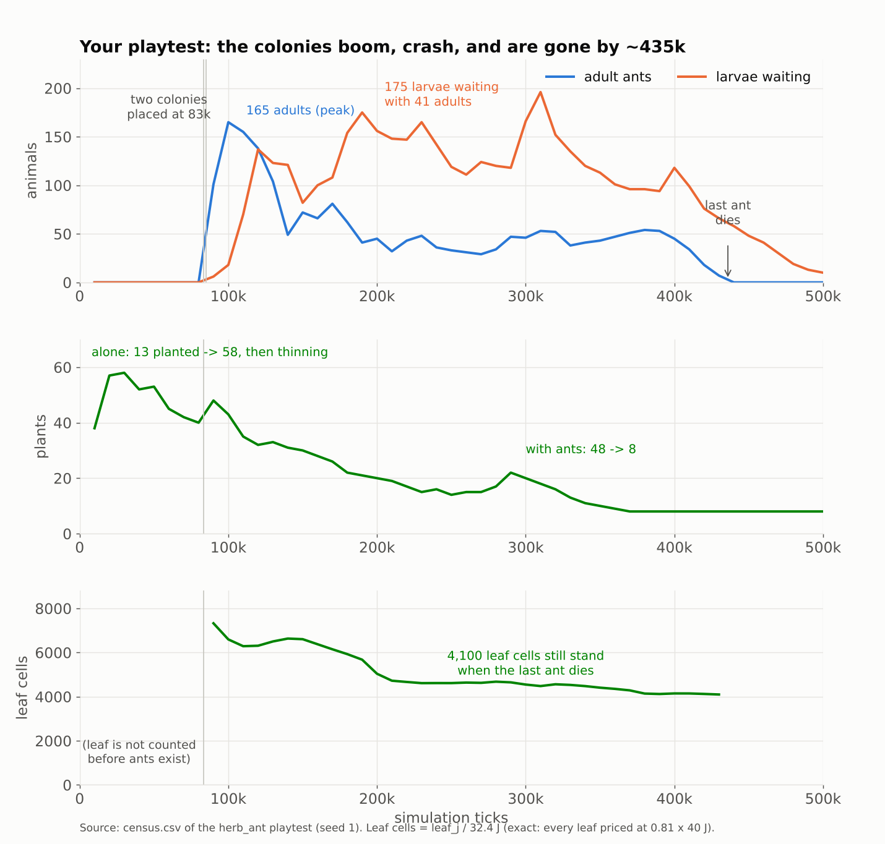

*The playtest's own census. Leaf is read as `leaf_j` / 32.4 J, so it stops when the last ant dies (§8).*

## 2. The replay, and how far to trust it

**Build.** Every number here was measured on the playtest's own build, `1bb916c1`
(branch `claude/eloquent-johnson-axjvu1-nest-life`, eight commits ahead of main
`43522586` when this was written: it adds `LAY_BRAKE` — on in the playtest, and
the over-laying of §4 happens with it on — `RECRUIT`, `MOUND_IN`, `STORE_READ`
and the DIG brush). `examples/replay.rs` is committed on main and compiles there,
**but main lacks those two switches, so a re-run on main will not reproduce these
numbers**: run it on that branch, or on main once it lands.

`examples/replay.rs` rebuilds the bed from the actions log. It is the same
`LabBox` (1,024 x 512, soil 176, ground row 256, no founders, no colonies), the
two dials the header names (`PLANT_LOAD_FAILURE false`, `DEVELOPMENTAL_KEY 1`),
the thirteen `PLANTED` lines at frame 0 and the two placements at the frames the
log gives, run under the header's switch bundle. `ants=0` is the same bed with
no colonies: **the control the playtest does not have.**

**Two bed settings the log does not record and the replay needed: rain off,
plants at half pace.** `CycleRain`, `CyclePlantPace`, `ToggleWindfallRot` and the
lamp toggles are not written to the actions log (`lab/mod.rs`), and the shipped
rain is *light*. Scanning the rain x pace grid, **rain off + half pace is the
only pair that reproduces the playtest's census exactly through tick 40,000**.
So the playtest bed had its rain off, which the header does not say.

**It does not stay exact.** By 50k the stand differs by one plant (54 against
53), by 100k the adults are 205 against 165. After that the six seeds are *the
owner's bed*, not *the owner's run*. The playtest sits inside the six-seed range
on every headline (plants at 250k: 14 against 7-25; adults at 250k: 33 against
0-75; peak adults 165 against 156-301). Thread count does not change a result
(checked); the decision log does not change one (it is a guarded switch).

**The arms.** All paired by seed, 450,000 ticks unless said, medians over seeds
with the per-seed values in the tables:

| arm | what changes | seeds |
|---|---|---|
| `alone` | no colonies | 1-6 |
| `ants` | **as played** | 1-6 |
| `noleaf` | `food_energy` 0 on `leaf`, `grassblade`, `moss` (`materials.reload`) | 1-6 |
| `noseed` / `noleafseed` | the same on `seed`, `pip` (and the leaf) | 1-2, 300k |
| `doortree` | a tree at x=748 and a conifer at x=304 planted at frame 0, ~20 columns from where the colonies will found | 1-4 |
| `leaf20` / `leaf160` | leaf and grassblade at 20 / 160 J (shipped 40) | 1-3, 300k |
| `mut_on` | `PIXEL_PHYSICS_MUTATION=on`, ants and no-ant twins | 1-4, 300k |
| `def<d>` | every plant organism at defence `d` (0.2, 0.35, 0.5, 0.9) at frame 0, mutation off; **needs the scratch hook in §9** | 1-3 (0.9: 1-2), 220k |
| `rain_light` / `rain_light_alone` | `rain=light`, the shipped rain, with the colonies and without | 1-2, 300k |
| `alone_long` | no colonies, rain off, to 1,500,000 ticks | 1-2 |

## 3. Ants -> plants

**The stand is stripped from the bottom up, and fast.** Plants standing at tick
250,000, six seeds:


| seed | 1 | 2 | 3 | 4 | 5 | 6 | median |
|---|---|---|---|---|---|---|---|
| no ants | 32 | 50 | 36 | 26 | 37 | 36 | **36** |
| as played | 12 | 10 | 15 | 25 | 9 | 7 | **11** |
| leaf inedible | 83 | 89 | 83 | 40 | 78 | 97 | **83** |

Leaf cells within 15 rows of the ground at 250k: **617 / 102 / 830** (no ants /
as played / leaf inedible). The curve is in `stand.png`: the as-played low
foliage is down by two thirds within ~50k ticks of the colonies' arrival and
flat after. **The total leaf standing is not much lower with ants (6,068 against
6,403 at 250k) because it is high: the trees' and conifers' crowns are out of
reach**, which is the picture in `look.png` — bare stems, bare lower crowns,
an untouched canopy.

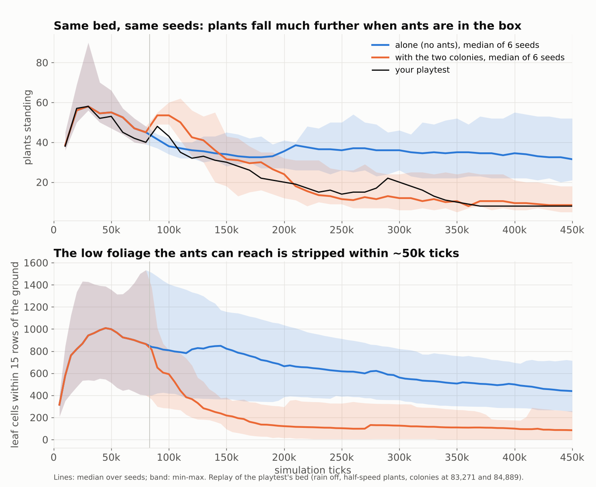

*Six seeds, medians with min-max bands; the black line is the playtest.*

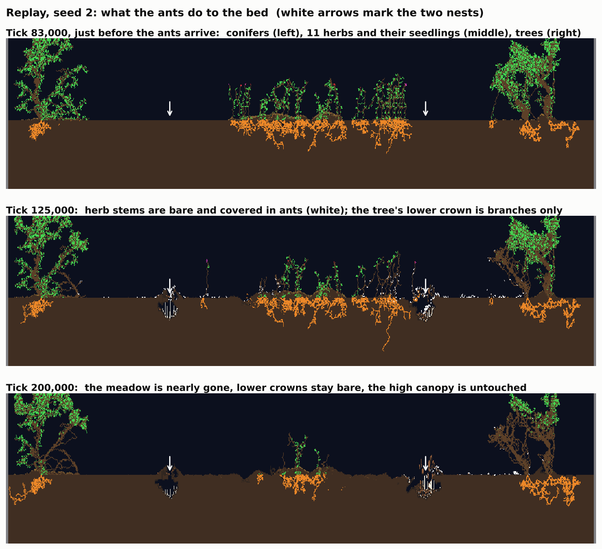

**A herb is either untouched or stripped.** `herb-dose.png`: founder herbs by
the leaf bites an ant took from them by 150k (the bite is attributed to the
nearest plant cell at the mouth; herbs that were alive in the no-ant twin at
150k, six seeds, paired by plant). None: 11 herbs, all intact. 1-10 bites: 19
herbs, median leaf left **7%** of the no-ant twin's, 47% dead. 11-50: 97 herbs,
0% left, 55% dead. 51-200: 32 herbs, 0% left, 56% dead. **There is no middle**
(CLAUDE.md law 1): a herb carries too few leaf cells for the size of a bite.

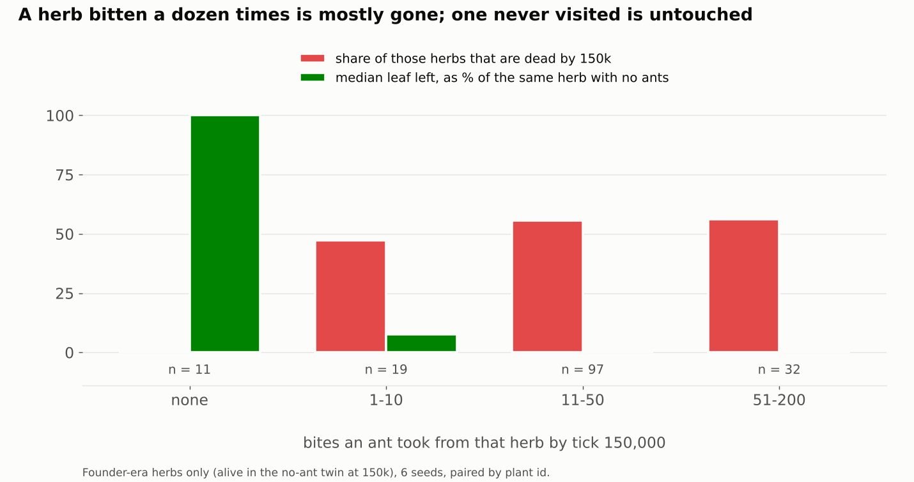

**Grazing is the whole of the loss.** With live leaf inedible the plants are
**83 against 36 with no ants at all**. The extra are herbs (63 against 31.5 at
250k, established plants only) and the trees are 3.5 against 2 — *inferred*:
the ants are seed carriers (§6), and with nothing eating the seedlings they
plant, they raise the stand. In the as-played bed the only plants left within
64 columns of a nest at 250k are trees: **9 established trees or conifers in six
seeds against 2 in the no-ant twin, and 0 herbs against 28.** The ants' own
trees survive them; the herbs do not.

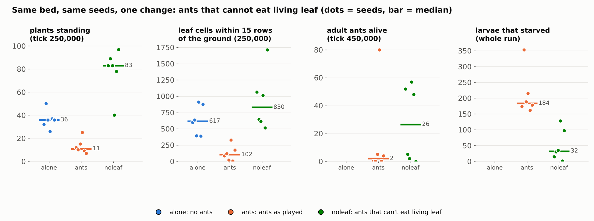

**It is not the seeds.** `noseed` (seeds and pips inedible, leaf edible), two
seeds: plants 19 and 9 at 250k against 12 and 10 as played; starved larvae 160
and 424 against 173 and 343. `noleafseed` (neither): plants 59 and 65 — fewer
than leaf-only (83, 89), because the colonies are smaller (peak 94 against 183
and 204) and plant less.

**Selection does not rescue it.** With mutation on (the shipped game's setting,
four seeds, 300k) the stand still falls to 8-23 plants at 250k against 27-39 in
the no-ant twin. The plants' defence does rise under grazing — mean of the
established plants **0.035 against 0.025** at 250k, 0.038 against 0.024 at
300k, the best seed 0.075 — but that is a palatability of 0.96, which is
nothing. The reflected walk drifts to ~0.025 with no animals at all; the
playtest had mutation off and every plant was at 0.000.

### 3a. A fixed defence does not give the stand a middle

The shipped graded lever is the plants' `defence` trait: palatability is
`1 - defence`, an eater passes a defended cell over with probability `defence`,
and construction costs `1 + defence` times the price. It was 0.000 in the
playtest. I put every plant organism of the bed at one value at frame 0 (an
eight-line scratch hook, §9, not committed; seeds inherit it exactly because
mutation is off) and ran 220k ticks, seeds 1-3 (0.9: seeds 1-2), medians:

| defence | plants at 80k (before the ants) | litter at 80k | plants at 200k | low foliage at 200k | adults at 200k | peak adults | eggs per Mtick | eggs that starve | adult starvation per Mtick | food taken in, kJ |
|---|---|---|---|---|---|---|---|---|---|---|
| 0 (shipped) | 36 | 147 | 16 | 101 | 68 | 275 | 36.7 | 27% | 5.5 | 2,103 |
| 0.2 | 35 | 90 | 10 | 141 | 11 | 218 | 54.3 | 39% | 10.3 | 1,454 |
| 0.35 | 42 | 72 | 11 | 96 | 17 | 176 | 32.7 | 26% | 13.6 | 897 |
| 0.5 | 33 | 84 | 11 | 116 | 0 | 123 | 26.6 | 40% | 9.5 | 501 |
| 0.9 | 23 | 34 | 24 | 237 | 0 | 104 | 0.5 | 0% | 125 | 22 |
| leaf inedible (no growth price) | 36 | 147 | 89 | 911 | 86 | 183 | 24.5 | 0% | 2.7 | 1,574 |

**The price of defence is the food.** The litter standing when the ants arrive
halves as defence rises, the colonies' intake falls monotonically (2,103 -> 22
kJ), and the herbs are not saved: 10-11 plants at 200k at 0.2-0.5 against 16
undefended (24 at 0.9 only because the colonies are already dead: at 0.9 the
adults starve within 10k ticks of placement). **Inedible leaf is free; defence
is not**, which is why the stand that is 89 plants with an inedible leaf cannot
be had by turning this trait up. What *selection* would settle at is a different
question; with mutation on the plants reach 0.035 by 300k (§3). One defended
run looks like the shipped colony — seed 2 at 0.35, 71 adults at 200k and 1,935
kJ taken in — and it is the one whose litter at 80k was 193 cells, against 72
and 67 in its sister seeds: the stand's early growth, not the defence, decided
it. Eleven defended runs, one such.

## 4. Plants -> ants

**The staple is dead leaves.** Energy taken in, as played, six seeds: **dead
leaves 60%, half-eaten leftovers re-eaten 24%, living leaf 8% (5-10% by seed),
seeds 7%, other 1%**; by number of bites **crumbs 49%, living leaf 25%, litter 21%,
seeds 4%** (`diet.png`). The colonies are not eating their way through the
stand for calories.

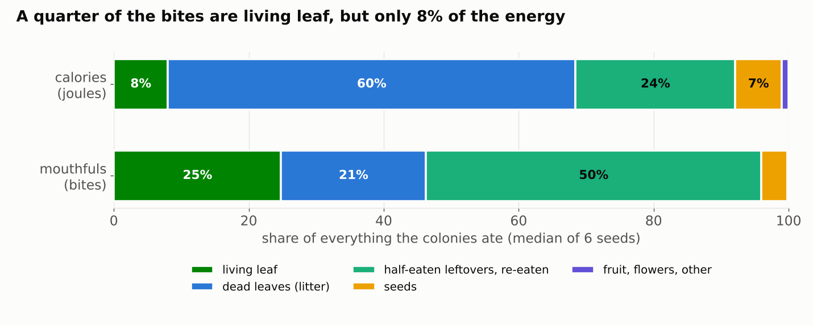

**What the colonies pay for the leaf** (first 300k ticks, six seeds, as played
against leaf inedible; `colony.png`):

| per million adult-ticks | as played | leaf inedible |
|---|---|---|
| eggs laid | **37.5** | 24.4 |
| adults hatched | 23.5 | 21.7 |
| eggs that starve as larvae | **30%** | 0.8% |
| adult starvation deaths | **8.7** | 3.2 |
| adult old-age deaths | 19.7 | 20.9 |
| food taken in, J per adult-tick | 0.099 | 0.095 |
| `Metabolized`, J per adult-tick | 0.034 | 0.025 |
| shared between ants (trophallaxis), J per adult-tick | 0.058 | 0.042 |
| adults on the surface away from the nest | 44% | 15% |

Every as-played seed lays more eggs per adult-tick than every leaf-inedible
seed (30.2-39.4 against 21.2-28.6). **The colony takes in the same food per
adult and hatches the same number, but lays half as many eggs again, and the
surplus starves.** Beside it, every internal counter says a hungrier colony
(differential census, per million adult-ticks, as played against leaf
inedible, six seeds): `hungry_out_pulls` 1,348 against 227 (**5.9x**),
larva-ticks hungry 17,302 against 2,473 (**7.0x**), larval upkeep burned 8,663 J
against 1,245 J (**7.0x**), `forage_returns` 41 against 51, **`seeds_carried`
12 against 85** — **no seed overlaps across the arms on any of these five** — and
ticks at the nest 77% (that one overlaps).

**The egg rule and the energy tail.** An egg's bar is the layer's own body
energy (`LAY_BAR=body`, `try_bud`): `lay_at` 1,100 J scaled by the founder's
`reproduce_at` trait, about **950 J** (the scaling is `reproduce_fraction`, read
as linear). Pooling the adults' energies in `ants.csv` over 100k-250k, **the
share of adults above that bar tracks the eggs laid** across every arm:

| arm | adults above ~950 J | eggs per million adult-ticks | eggs per point |
|---|---|---|---|
| leaf inedible | 4.1% | 24.4 | 6.0 |
| as played (40 J) | 6.6% | 37.5 | 5.7 |
| leaf 20 J | 7.1% | 39.7 | 5.6 |
| door trees | 7.3% | 39.3 | 5.4 |
| leaf 160 J | 8.5% | 42.7 | 5.0 |

and the spread is wider whenever the leaf is edible, at any dose: **Gini of
the adults' banks 0.38-0.39 against 0.33; adults under 100 J 2.0-3.5% against
0.8%; p10 158 J against 184 J, p90 839 J against 720 J** (start energy 200 J).
So the extra eggs are laid by the rich tail the same intake leaves behind, and
the poor tail is what starves: **the same mean food held more unequally lays
more eggs and starves more adults**. This is a population-level link between
two measured distributions and a rule read in the code, *not a trace*: nothing
here follows an ant from a meal to an egg. **What makes the banks unequal when
leaf is edible is the open question** (§4a rules out the leaf's calories).

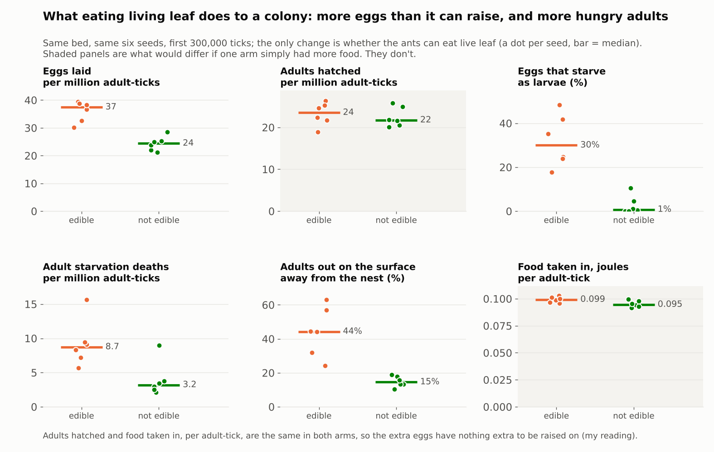

**Food is not scarcer than without the leaf; it is farther.** The J-weighted distance of a litter,
seed or leaf bite from the door, as played: 94 columns at 85k, **117 at 115k**,
99 at 165k, ~30 after 225k (the survivors forage near home); leaf inedible:
106, 51, 23, ~25. Income per adult as played falls from **160 J per 1,000 ticks
at 90k to 71 at 150k** (the first starvation wave) and sits at ~90-105 after;
leaf inedible, 106 -> 126 -> 82 -> ~95; door trees 181 -> 94 -> ~100. All three
arms settle at ~0.1 J per adult-tick, so colony size follows the supply.

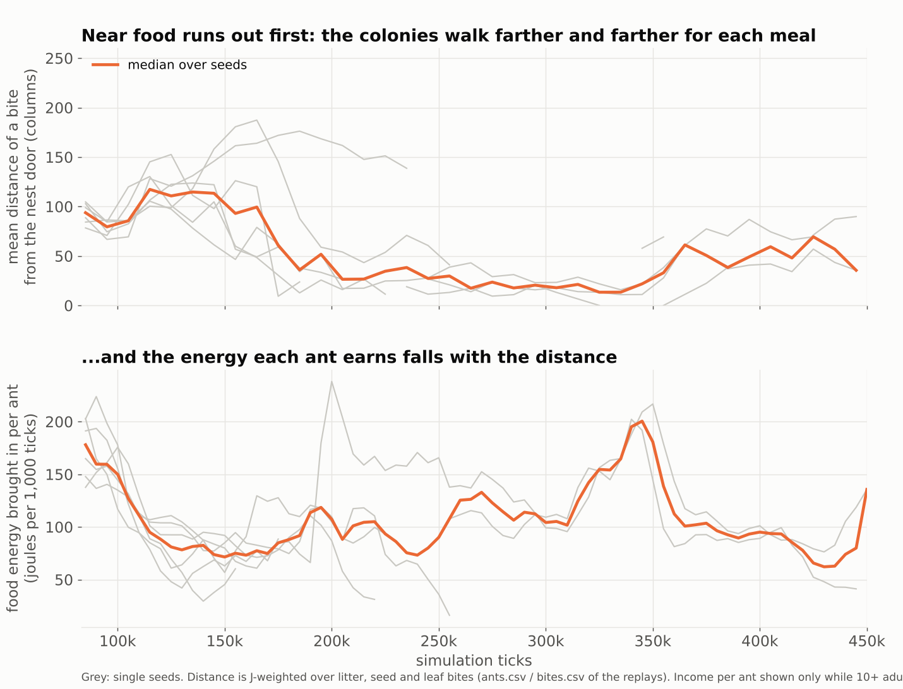

**Boom, then crash.** Peak adults as played 249 (median; 156-301), leaf inedible
194 (167-263); adults at 100k/200k/250k as played 166/38/12, leaf inedible
107/84/80. Total adult-ticks lived over 450k are similar (21.0M against 24.5M,
the as-played s3 resurges to 287 at 350k) — what differs is how soon, and how
the brood fares: **starved larvae over the run 184 against 32 (median), no
overlap between arms** (the as-played minimum 162 is above the leaf-inedible
maximum 128).

**Colonies alive.** Adults at 250k: as played 0, 0, 75, 35, 23, 1 (median 12);
leaf inedible 46, 78, 81, 125, 86, 37 (median 80). At 450k leaf inedible is 52,
5, 2, 57, 48, 0 (median 26) and as played 0, 0, 5, 80, 0, 4 (median 2): the
protection fades; it is not a cure.

### 4a. The leaf dose

`leaf20` and `leaf160` (leaf and grassblade at 20 and 160 J a cell, shipped 40;
seeds 1-3, 300k ticks; `leaf-dose.png`), medians of three, against leaf
inedible and as played on the same seeds:

| leaf, J per cell | 0 (inedible) | 20 | 40 (as played) | 160 |
|---|---|---|---|---|
| plants at 250k | **83** | 13 | 12 | 14 |
| seeds carried home per Mtick | **87** | 15 | 10 | 9 |
| hungry-out pulls, thousands per Mtick | **0.2** | 1.9 | 1.5 | 1.6 |
| eggs laid per Mtick | 22 | 40 | 37 | 49 |
| eggs that starve as larvae | **0%** | 41% | 42% | 35% |
| adult starvation deaths per Mtick | 3.0 | 7.8 | 8.3 | 5.6 |

**The step is from inedible to edible, and there is no slope.** Half the leaf's
energy ruins the stand as thoroughly as the shipped value, four times the energy
does not ruin it more, and no counter moves in proportion to the calories (160 J
lays *more* eggs and starves fewer adults, the energy-tail reading of §4: richer
adults cross the bar). **So the leaf's calories are not what hurts the colony;
the ants engaging with leaf as a food at all is**: they stop carrying seeds home
(9-15 against 87 per Mtick) and are pulled out of the nest hungry 8x as often.
Edibility is a step on the bite's priced worth (`EAT_YIELD_THRESHOLD` is 12 J
and a leaf cell is worth 0.81 of its `food_energy`), so anything above ~15 J is
on the menu. **A seed rides home only if the ant bit it and the seed survived**:
with seeds inedible (`noseed`) the ants carried 0.07 per Mtick, with neither
leaf nor seeds 0.9, with seeds on the menu and leaf off 85 — *the garden is made
of seeds the ants ate*, and an edible leaf takes the ants off them.

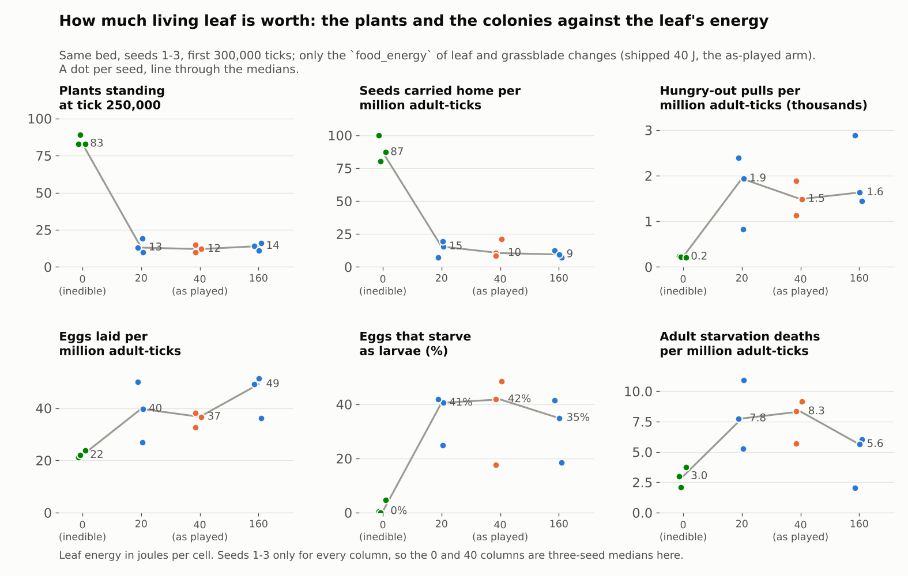

## 5. Plants and the nests

*The owner: "it seems like the plants can interrupt the nests".*

**Roots do not grow into the nest.** The census partitions every cell the ants
dug (`dug_open`, `dug_roots`, `dug_plant`, ...). Worst moment, share of dug
cells closed by root or plant tissue: **playtest 2.1% (37 of 2,141); as played
0.6-5.2% (median 1.3%); door trees 0.1-0.9%.** With plants thriving it is not
small: **leaf inedible 10.6-35.2% (median 19%)**, mostly shoots and buried
seeds — the ants set 827-2,151 seeds on the nest in that arm against 119-210
as played — and the nests are 25-60% smaller at 100-150k (box void at 150k 449
and 363 cells at the two sites against 585 and 539 as played). The colonies are
the healthier ones anyway.

**Wood and roots are walls.** The dig trace (`DecisionRow`, 3 as-played seeds,
6 colonies): of the dig attempts that met solid ground (soil, packed soil,
spoil, wood, root, deadwood, log) **a median 19% hit wood or root (3.9-28.7%)**;
the jaw cannot cut a plant kind (`jaw_can_cut`), so those attempts are void.

**A tree at the door takes the site.** `doortree`, four seeds, eight colonies
(`plants-nests.png`):

| | as played | with the door trees |
|---|---|---|
| founders placed (of 52 asked) | 35-52 | 25-42 |
| dig attempts at solid ground hitting wood/root | 4-29% | 20-82% |
| nest void in the box at 150k (cells) | 348-732 | 11-725 |
| peak adults per colony, median | **124** | **208** |
| colonies at or above 10 adults at 250k | 3 of 8 | 6 of 8 |
| forage trips that bring food home (300k) | 13.0% (11.6-14.4) | **20.6% (17.0-25.6)** |
| adults out on the surface away from the nest | 44% | 31% |
| eggs that starve as larvae | 30% | 19% |
| food taken in, J per adult-tick | 0.099 | 0.108 |

The worst site, seed 1 colony 1: 82% of its digs hit wood, **the nest never
exceeded 31 cells** (about 600 as played), founders placed 36 of 52 — and the
colony still held 60 adults at 150k and 38 at 200k, against 9 and 5 for the
as-played colony on the same site. The best, seed 3 colony 2 (**peak 669
adults**), made 60,754 cuts with 67% of its dig attempts hitting wood. *Inferred:*
**the tree is a food source the ants cannot strip** — its canopy is whole in
every arm — **at the door**, and at that distance the colony does not need a big
nest to be a big colony; the return rate and the shorter surface time fit, but
no litter flux was measured. The benefit fades by 400k (adults at 450k: 0, 22,
75, 0). It does not save the stand: plants at 250k are 10, 10, 11, 20.

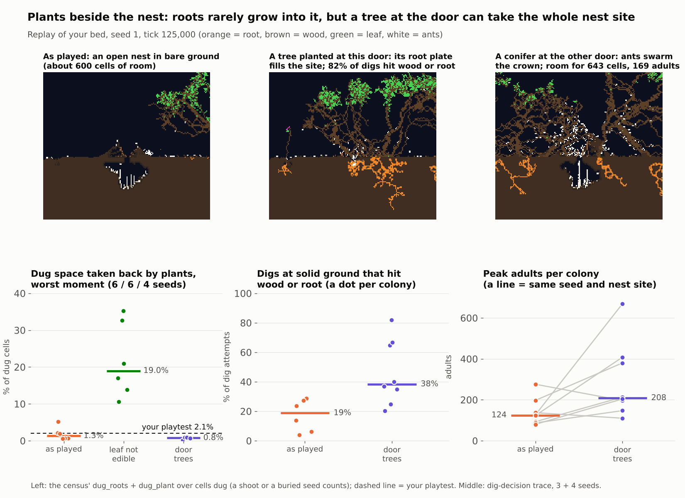

**The ants plant the thing that ends up beside the door.** As played, plant
cells within 64 columns of a nest rose eightfold in the 60k ticks after
placement (275 -> 2,185, §1); in the pictures (`nest-pictures.png`) the thing beside
the door is a tree, and at 250k the only plants within 64 columns of a nest are
trees (9 against 2 in the no-ant twin, **0 herbs against 28**).

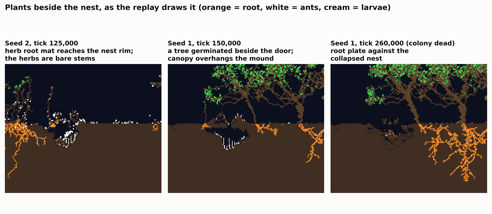

## 6. Other trends

**The founding cohort ages out, and that is most of the first crash.** Adults
are placed as adults and live ~35-40k ticks (mean lifespan per adult-tick:
35.8k as played, 41.1k leaf inedible; old-age deaths 19.7 / 20.9 per million
adult-ticks, the same either way). In the playtest 134 of the first 189 deaths
were old age. A colony's standing size after the founders go is a trickle of
hatches (~1 per 1,000 ticks from 200k to 400k) times a lifespan — which is why
~45 adults held for 200k ticks and why, when the hatches stopped at ~410k, the
colony was gone in 30k.

**Starvation comes in waves, and the waves are the food getting farther.** The
playtest's three (130-140k, 180-190k, 200-210k) sit where the replays' bite
distance peaks (117 columns at 115k) and income per adult bottoms (71 J per
1,000 ticks at 150k).

**One trip in eight brings food home.** 799 of 6,176 forage trips (12.9%) in the
playtest, 13.0% as played over six seeds, 14.0% leaf inedible. **Door trees
raise it to 20.6% (17.0-25.6%, above every as-played seed)** — the cleanest
single number for "the food is nearer".

**The ants are gardeners.** 188 seeds carried home in the playtest, 143 left on
the nest ground, 44 set on wet soil. With leaf inedible the ants set 827-2,151
seeds on the nest per run and the bed holds **63 herbs against 31.5 with no ants
at all**; as played the trees within 64 columns of a nest outnumber the no-ant
twin's 9 to 2. The seedlings the ants plant are what they then graze (§3).

**The stand dies on its own in this bed, and the ants only get it there first.**
With no ants at all and the rain off, plants fall from 31-36 at 100k to **5-16
at 1.5M** (seeds 1 and 2) and the leaf standing from 6,600-7,700 cells to
**44-217**; the dormant-seed bank falls from 330-400 to 3-19 and nothing
replaces the founders, who die `OLD AGE` from ~720k and `STARVED` (carbon)
throughout (`alone_long`, seeds 1 and 2). **The playtest's tail — 8 plants at
500k, 1 from 1.3M — is that same process begun from a stand the ants had cut to
a fifth.**

**The shipped rain changes the stand's size, not the grazing** (`rain=light`,
seeds 1 and 2, 300k; the shipped rain is light and the playtest bed had it off,
§2). The no-ant stand at 250k is **4x bigger** (145 and 138 plants against 32 and
50) and with the colonies in the box it is 63 and 113 plants: down **57% and
18%**, not the 62-80% of the same seeds with the rain off, because rain-fed recruitment refills
it. **The reachable foliage is stripped just as hard: low foliage 279 and 299
cells against 1,197 and 1,382 (-77% and -78%).** Colonies: peak 291 and 216
adults, 469 of 1,214 and 110 of 835 eggs starved as larvae (39% and 13%), 5 and
53 adults at 250k. So the herb-level result (§3) and the colony's costs (§4)
stand under the default rain, and **how far the *stand* collapses is partly a
rain-off result**; a long default-rain no-ant control (`rain_light_alone_long`)
was queued and not run.

**Evolution was off, and on it is too slow.** §3: defence 0.035 against 0.025
at 250k, four seeds, the stand unchanged.

## 7. What this does not establish

1. **Why leaf makes extra eggs, and why adults starve at 2.7x.** §4 is a
   fingerprint, not a trace. Every number in it is a population count over
   six seeds; **none follows an individual ant**, which is how this repo says a
   *why* is answered. The code reading (an egg's bar is the layer's own body
   energy) is a hypothesis; the leaf dose (§4a) bears on it but cannot prove
   it. The trace that would: per egg, the layer's id, bank, place, and the
   material and age of its last bite, in an as-played and a leaf-inedible run of
   one seed. `DecisionRow` already carries `bite`, `energy_j` and `trip_src`;
   the egg's layer would have to be logged where `lay_egg` places it.
2. **What the owner saw at the nests.** "Plants can interrupt the nests" has
   three readings here — roots growing in (2.1%), wood and roots as walls
   (19% of digs), a tree taking the site (82% at the worst door) — and I measured
   all three without knowing which was seen. If it was something else (the door
   blocked, the mound overgrown, an entrance roofed by roots) it is not in
   this report.
3. **One bed.** The colonies were placed 108-336 columns from the herbs. The
   door-tree result says that distance matters; a colony placed in the meadow
   is a different experiment and was not run.
4. **The replay is the bed, not the run** (§2). Paired comparisons inside it are
   sound; "the playtest would have done X" is not.
5. **Small n for the later arms.** Six seeds for the main three; four for door
   trees (eight colonies); three for the leaf dose and the fixed defence (two
   at 0.9); two for `noseed`, `noleafseed`, the default rain and the long
   control. Medians and ranges throughout, never a
   p-value; the as-played spread is wide (peak adults 156-301).
6. **The garden claim is inferred.** That the extra herbs in the leaf-inedible
   bed come from the ants' planting rests on the seed counts and on the herbs
   being near the nests; no seed was followed from carry to seedling.
7. **Rain.** The playtest and every main arm have it off; §6 has the one
   default-rain contrast, two seeds, 300k, and no long default-rain control.

## 8. Reading the census: seven traps

1. **`brood_larvae_hungry` is `brood_larvae`**, every row: a fed larva pupates
   at once, so "all the larvae are hungry" is a tautology. Use
   `larvae_starved / eggs_laid` (53% here).
2. **`ants` is adults only; `plants` is non-seed organisms; `seed_bank` is
   dormant seeds plus single-cell organisms.**
3. **The `*_j` columns are priced at the living ants' mean gut**, so they read
   **0 with no ants** (the leaf series stops at the last ant) and they jump with
   the gut: litter and seed are 388.8 J a cell at gut -0.8 and 120 at gut 0. The
   playtest's gut was -0.8 throughout; leaf is 32.4 J a cell at any gut
   (0.81 x 40). Count cells, not joules, across a gut change.
4. **"Afield" is the census's own place, not "above ground":** beyond
   `NEAR_NEST_COLS` (40) of every nest and above the surface datum. 66-83% of
   adults are above ground at any moment, so a death "above ground" says
   little; 6.5% of the playtest's starvers died `under`, 45% `near`, 49% `afield`.
5. **The actions log omits** `CycleRain`, `CyclePlantPace`, `ToggleWindfallRot`
   and the lamps, and the header omits them too: the playtest's rain was off
   and nothing in the file says so (§2).
6. **`EATEN` in the death histogram is organisms whose last cell an animal
   ate — mostly dormant seeds** (3,200 in a leaf-inedible run, where the ants
   eat seeds instead of leaf). It is not plants killed.
7. **`bare_in_band` counts a column as vegetated if any plant cell stands in
   it, roots included**; `mound_bare` is the one that asks whether the anthill
   is green (it is not: 93 of 104 mound columns bare at 150k).

## 9. Reproducing

`examples/replay.rs`, driven by `run.sh` beside this file (`bash run.sh OUT ARM
SEED [FRAMES]`: every arm above, with the ablation directories made on the fly)
and read by `tables.py` (`python3 tables.py OUT playtest`: every table here).
By hand: build with `set -o pipefail; cargo build --release --examples`,
export the header's switch bundle (the chronicle's `SWITCHES:` line), and:

```text
replay frames=450000 seed=1 ants=1 rain=off pace=half out=DIR      # as played
replay frames=450000 seed=1 ants=0 rain=off pace=half out=DIR      # the no-ant twin
replay ... assets=ablate/noleaf      # materials.reload over a directory of .ron files
replay ... doortree=1                # a tree and a conifer by the doors
replay ... png=83000,125000,150000   # 2px/cell rasters of rows 150-345
```

**The fixed-defence arms (§3a) used an eight-line scratch hook that is not committed**
(it adds a public method to `World`, a contested file), so `run.sh` has no arm for
them: in `src/sim/world.rs`, beside `organism_mut`,

```rust
pub fn set_plant_defence_for_experiment(&mut self, d: f32) {
    for slot in self.organisms.iter_mut() {
        if let Some(s) = slot.state.as_mut() {
            if self.species.get(s.species).creature.is_none() {
                s.defence = d;
            }
        }
    }
}
```

and in `replay.rs`, after the plantings, `if let Some(d) = arg::<f32>("defence") {
lab.world.set_plant_defence_for_experiment(d); }`.

`probe=` / `snap=` / `antsnap=` set the stand and larder rows (raw cells), the
per-plant tables, and the adult positions. It writes `probe.csv`, `ledger.csv`
(colony accounts and diet by material), `deaths.csv`, `stats.csv`, `bites.csv`,
`digs.csv`, `plants_F.csv`, `leaf_F.csv`, `seeds_F.csv`, `grazed_F.csv`,
`ants.csv`, `events.txt`, and the lab's own chronicle under `chron/`. **It
echoes its own parameters; an unknown argument is ignored**, so read the first
line. The ablation directories are three-line edits of `leaf.ron`,
`grassblade.ron` and `moss.ron` (`food_energy`).
